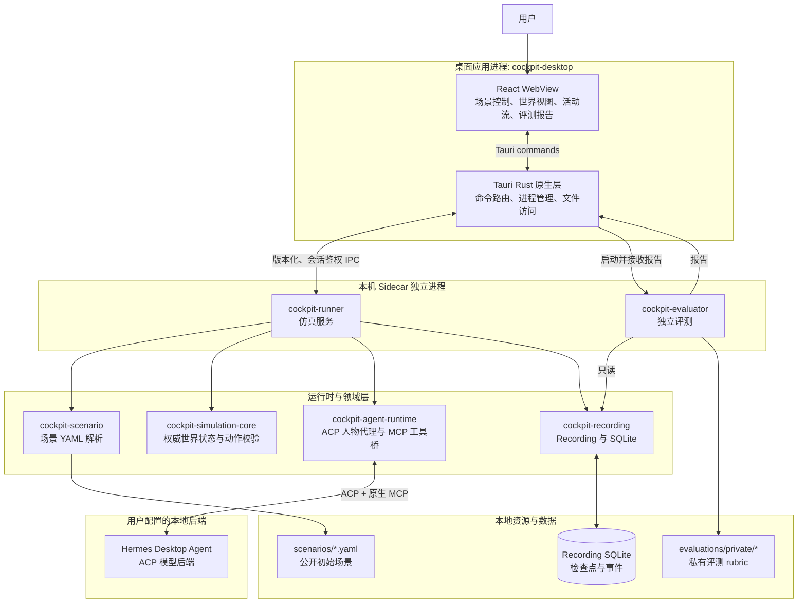
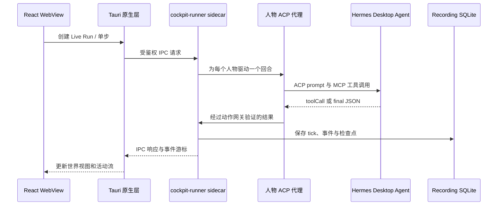

# Cockpit Desktop 分层架构与 Sidecar

## 一句话说明

**Sidecar（伴随进程）**是由 Cockpit Desktop 原生层启动并管理的独立本地可执行程序。它不是浏览器插件、云服务，也不是另一个桌面窗口。它将模拟运行和独立评测从 WebView 与桌面进程中隔离出来；Desktop 通过本机受鉴权的 IPC 与它通信。

## 分层架构图

## Sidecar 分工

| 进程 | 何时启动 | 职责 | 可访问的数据 |
| --- | --- | --- | --- |
| `cockpit-runner` | Desktop 创建或恢复仿真时 | 载入场景、维护权威世界状态、执行动作校验、驱动 Live ACP 人物回合、保存 Recording | 公开场景、模拟状态、Recording SQLite；**不读取私有 rubric** |
| `cockpit-evaluator` | 用户请求评测时 | 只读 Recording，按私有 rubric 生成 `pass`、`fail` 或 `inconclusive` 报告 | Recording、私有 rubric；**不修改仿真世界** |

`cockpit-runner` 是仿真的 Ground Truth 所有者。前端展示状态和发送命令，但不直接修改世界。`cockpit-evaluator` 则是独立评测平面，避免运行中的模拟进程既执行又给自己评分。

## 一次 Live 运行的数据流

