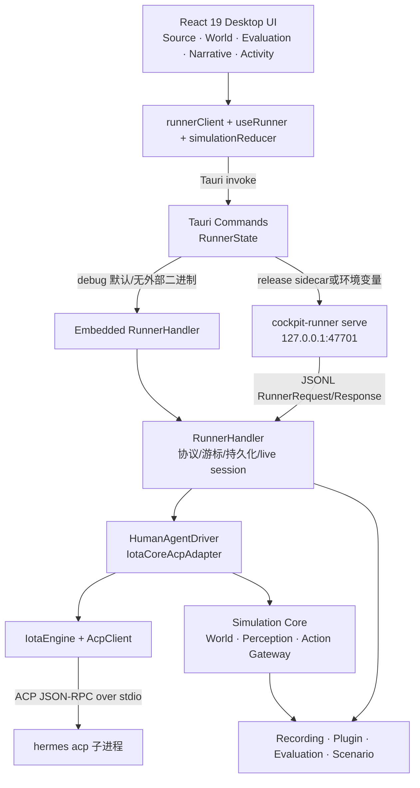
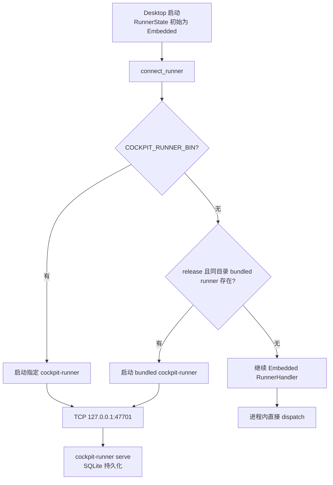
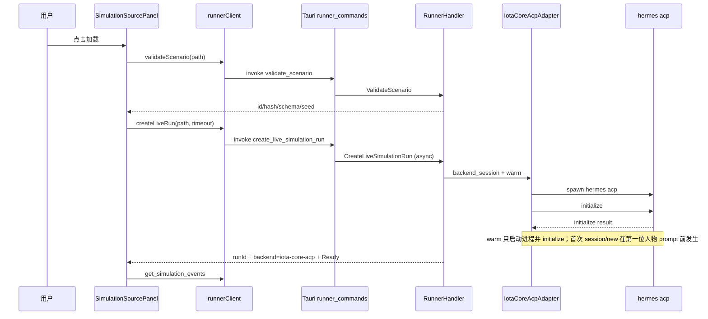
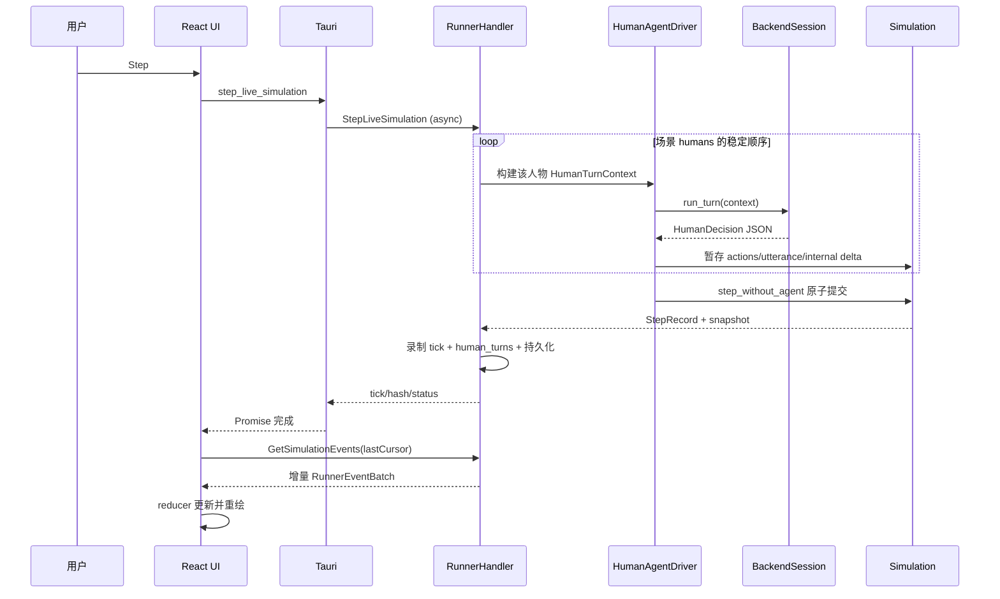
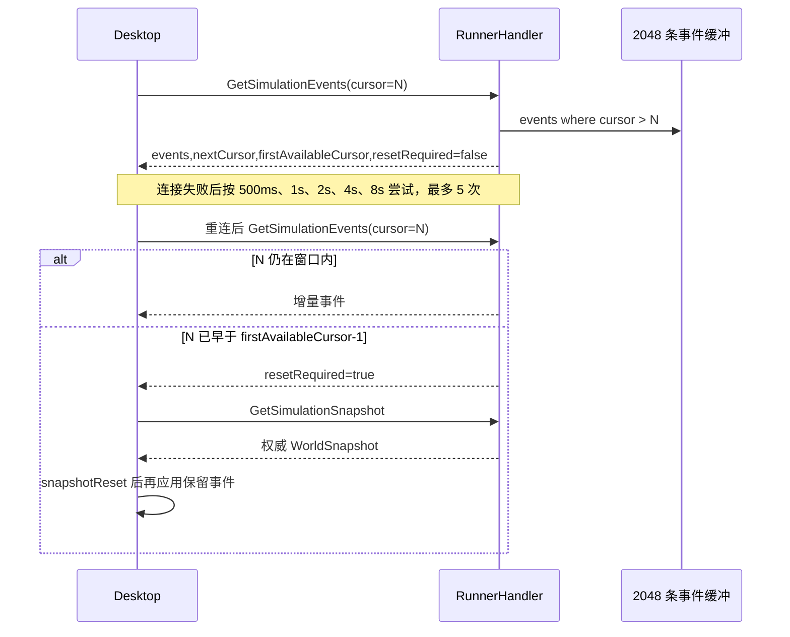
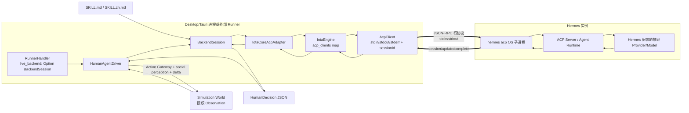
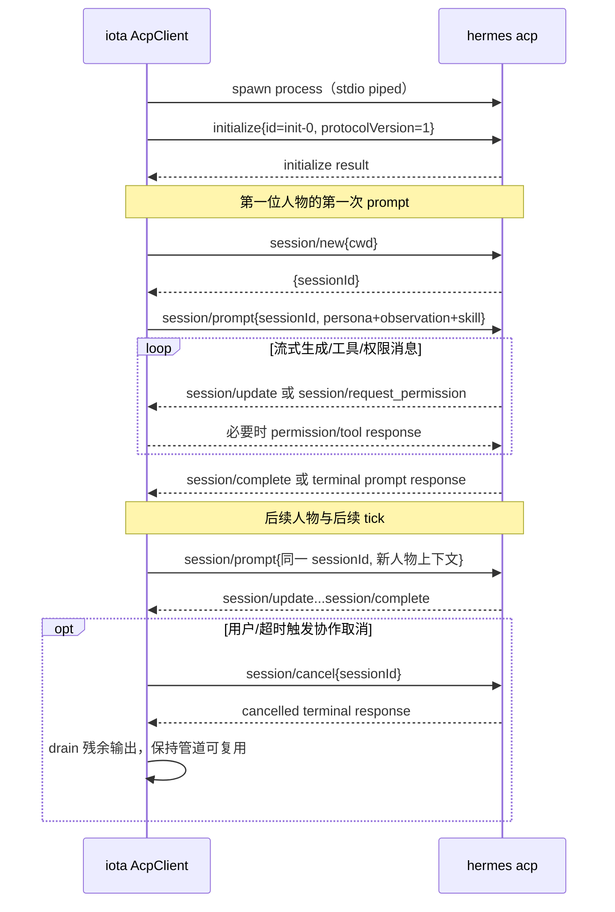
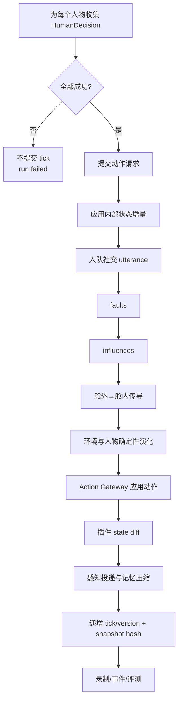
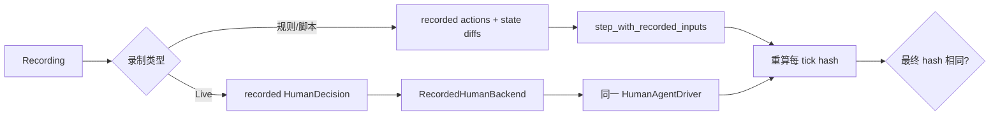

# Cockpit Desktop 仿真统一指南

> 本文是 Cockpit Simulator 桌面端的统一用户、场景、架构、流程和验收文档，合并并取代原有六篇分散文档。
> 内容以 2026-07-14 工作区代码为准，而不是按旧文档推断。

## 1. 文档定位与当前实现基线

本文面向桌面用户、产品演示人员、测试人员、算法工程师和开发者，回答五个问题：

1. 如何启动和操作 Cockpit Desktop；
2. 10 个标杆场景分别验证什么；
3. React、Tauri 与 `cockpit-runner` 如何通信；
4. 一次仿真单步如何创建并调用 Hermes ACP 实例；
5. 如何验证确定性、权限、安全、回放和原生打包。

### 1.1 必须先明确的边界

- **Desktop Live 当前只有模型驱动**：最新 `SimulationSourcePanel` 已删除 `RuleAgent` 切换。加载场景会调用 `CreateLiveSimulationRun`，单步只调用 `StepLiveSimulation`，真实后端标签为 `iota-core-acp`。
- **RuleAgent 仍存在，但不在 Desktop Live UI 中**：它服务于 Rust CLI 的离线规则演示、Runner 同步 IPC 合约和自动化测试，不能描述成 Desktop Live 的后备路径。
- **模型失败不降级**：任一人物的后端调用失败、超时或输出无效时，本 tick 不提交，运行进入失败；不会用 `RuleAgent` 或 `synthetic` 替代结果。
- **存在受限的传输恢复，不等于业务 fallback**：`session/new` 尚未提交 prompt 时可安全重建 ACP client 一次；iota 执行锁碰撞可使用新请求标记重试，最多 3 次。真正的模型 turn 失败不会替换为伪造结果。
- **人工审批和自动步进未在 Live UI 开放**：Runner 协议仍有审批与取消命令，但当前模型驱动界面只允许加载、开始、暂停、单步、停止；后端 turn 进行中这些控制会被锁定。
- **浏览器 Vite 页面只是 UI 预览**：不在 Tauri WebView 中时，`runnerClient` 不会连接真实 Runner，不能据此验收仿真或 Hermes。
- **Cockpit 与本地 iota 不是自动联动的源码依赖**：Cockpit 的 `Cargo.toml/Cargo.lock` 固定 `iota-core` revision `d29de2e…`；本工作区 `iota-sympantos` HEAD 为 `f204ee1…`。理解最新 iota 代码不能等同于 Cockpit 已自动升级依赖。

### 1.2 当前协议与录制版本

| 项目 | 当前值 | 代码位置 |
|---|---:|---|
| Runner IPC | `1` | `cockpit-runner/src/ipc/proto.rs` |
| Recording schema | `1` | `cockpit-recording/src/lib.rs` |
| Runtime contract | `2` | 同上 |
| World model | `4` | 同上 |
| Runner 事件历史 | 2048 条 | `RunnerHandler` |
| IPC 单帧上限 | 1 MiB | `cockpit-runner/src/server.rs` |
| Desktop 重连 | 500ms 起、8s 封顶、最多 5 次 | `src/config/constants.ts` |

---

## 2. 快速开始

### 2.1 环境要求

- macOS、Windows 或 Linux；
- Node.js 18+；
- Rust 1.95+（workspace 当前 `rust-version`）；
- 已安装并配置可执行的 `hermes`，且 `hermes acp` 可启动；
- 建议至少 4GB 内存，并为录制数据库预留磁盘空间。

### 2.2 UI 预览

```bash
cd apps/cockpit-desktop
npm run dev -- --host 127.0.0.1 --port 15342
```

打开 `http://127.0.0.1:15342`。该模式可检查布局和本地化，但 `runnerClient.isTauri()` 为 false，场景与后端数据是预览占位，不会启动 Hermes。

### 2.3 原生 Tauri 开发

```bash
cd apps/cockpit-desktop
npm run tauri:dev
```

- debug 构建且未设置 `COCKPIT_RUNNER_BIN`：Tauri 进程内使用 Embedded `RunnerHandler`；Desktop 仍会通过 iota-core 启动真实 `hermes acp`。
- 显式外部 Runner：

```bash
export COCKPIT_RUNNER_BIN=/absolute/path/to/cockpit-runner
npm run tauri:dev
```

此时 Tauri 启动独立 `cockpit-runner serve`，通过 `127.0.0.1:47701` 通信。

### 2.4 生产打包

```bash
cd apps/cockpit-desktop
npm run tauri:build
```

构建脚本将 `cockpit-runner-<target-triple>` 作为 `externalBin` 打入应用。release 运行时按以下优先级选择 Runner：

1. `COCKPIT_RUNNER_BIN`；
2. 与 Desktop 主可执行文件同目录的 `cockpit-runner`（Windows 为 `.exe`）；
3. 若均不可用才保留 Embedded 处理器。

外部 Runner 使用临时目录下的 `cockpit-runner-recording.sqlite` 持久化已提交 tick，并可在进程重启后恢复。

### 2.5 CLI 路径

```bash
# 场景校验
cargo run -p cockpit-runner -- validate scenarios/smoke-in-cockpit.yaml

# 离线规则演示：RuleAgent，不调用 Hermes
cargo run -p cockpit-runner -- run scenarios/smoke-in-cockpit.yaml --ticks 80

# 默认构建的 run-live：显式 synthetic 后端，仅用于离线开发
cargo run -p cockpit-runner -- run-live scenarios/smoke-in-cockpit.yaml --ticks 80

# 真实 iota-core ACP / Hermes
cargo run -p cockpit-runner --features live-acp -- \
  run-live scenarios/smoke-in-cockpit.yaml --ticks 80 --timeout-ms 60000
```

`synthetic` 是编译配置选择，不是 Hermes 失败后的 fallback；真实 `live-acp` 失败时运行直接失败。

---

## 3. Desktop 操作指南

### 3.1 界面布局

```text
┌────────────────────────────────────────────────────────────────────┐
│ Header：连接状态 · 场景 · tick/仿真时间 · backend · 语言 · 帮助    │
├───────────────┬──────────────────────────────────┬─────────────────┤
│ Source        │ World 世界平面图                 │ Evaluation      │
│ Live / Replay │ 人物/设备/环境/系统状态/因果高亮 │ Narrative       │
├───────────────┴──────────────────────────────────┴─────────────────┤
│ Activity：世界事件 · HumanTurn · 工具调用 · 动作结果 · 导出       │
└────────────────────────────────────────────────────────────────────┘
```

- **Source / Live**：标杆场景、路径、模型超时、加载与运行控制、处置契约、14 域矩阵。
- **Source / Replay**：选择录制、执行回放、比较两份录制。
- **World**：舱室俯视平面图、人物/设备标记、烟雾/雾化/明火/告警叠加、最近影响目标高亮。
- **Evaluation**：通过状态、得分、解释、证据事件 ID、首个失败 tick。
- **Narrative**：按人物显示已感知的物理事件和社交发言，以及长期记忆数量。
- **Activity**：按 tick 合并事件、工具调用、人物 turn 与动作结果。

### 3.2 加载场景

1. 从 10 个内置标杆场景中选择，或输入/浏览 `.yaml/.yml` 路径；
2. 设置模型超时，默认 60,000ms，允许 2,000–120,000ms；该值只对下一次加载生效；
3. 点击加载；前端先调用 `ValidateScenario`；
4. 校验成功后调用 `CreateLiveSimulationRun`；
5. Runner 加载 Skill，创建 `IotaCoreAcpAdapter` 并执行 Hermes ACP warm-up；
6. 成功后状态进入 `ready`，Header 显示 `iota-core-acp`。

快速重复点击由 React ref 锁阻止，避免并发触发多个昂贵的 Hermes warm-up。

### 3.3 运行控制

| 控制 | 条件 | 实际命令 |
|---|---|---|
| 开始 | `ready/paused/degraded` | `StartSimulation` |
| 暂停 | `running` 且无 turn 在途 | `PauseSimulation` |
| 单步 | `ready/running/paused` 且无 turn 在途 | `StepLiveSimulation` |
| 停止 | `running/paused` 且无 turn 在途 | `StopSimulation` |

一次 Live 单步会让场景中的**每个人物依次完成一次后端 turn**，并在全部成功后原子提交一个 tick。turn 在途时显示脉冲状态，避免重复单步。

快捷键：

| 快捷键 | 功能 |
|---|---|
| `Space` | 暂停 |
| `S` | 单步 |
| `?` | 快捷键帮助 |
| `Esc` | 关闭帮助 |

输入框、文本区或下拉框聚焦时快捷键不触发。

### 3.4 世界视图

`cabinLayout.ts` 把字符串 `location` 映射到 Cockpit、Rear Left、Rear Right、Cabin 等区域。仿真核心不保存二维坐标；未知 location 使用通用布局。同一区域实体通过稳定哈希偏移防止完全重叠。

- 人物：姓名、角色、stress、attention、health；
- 设备：ID、生命周期、health、能力数量与故障；
- 环境：舱外温度/风、舱内温度/烟雾、能见度雾化、明火和告警；
- `cockpitSystems`：气候、驾驶辅助、乘员照护、体验、移动、连接和网络安全权威状态；
- Last Effect：优先取最新带 target 的 `ActionResult`，否则取最新目标事件，在对应标记上显示琥珀色高亮。

当前 `DeviceState` 没有统一 location 字段，部分设备可能落入默认区域；这属于呈现边界，不影响核心状态。

### 3.5 Activity、脱敏与审批边界

Activity 合并展示：

- `SimulationEvent`；
- `SimulationHumanTurn`；
- `SimulationToolCall`；
- `SimulationActionResult`；
- 插件失败和评测更新。

导出支持事件 JSON/CSV、工具调用 JSON/CSV、动作结果 JSON。敏感字段（如 api key、token、secret、password、credential、reasoning）会递归脱敏，自由文本的 live 证据也会按契约处理。

Runner 的 `ApproveAction/RejectAction/CancelAgentTurn/SetApprovalRequired` 仍是协议能力，Activity 也保留待审批呈现逻辑；但最新 Desktop Live 不开放审批开关和在途取消按钮。不要把规则模式审批流程写成当前 Live 用户能力。

### 3.6 Replay 与差异对比

1. 先在 Live 标签加载匹配场景；
2. 切换 Replay；
3. 选择录制文件并执行回放；
4. 如需确定性比较，再选择候选录制并点击 Compare。

差异报告包含 `equivalent`、首次分歧 tick、两侧 metrics 和逐 tick 差异。规则录制按 action/state diff 重放；live 录制必须按已记录的每人物 `HumanDecision` 通过 `RecordedHumanBackend` 重放，过程中不再调用 Hermes。

---

## 4. 10 个智能座舱标杆场景

### 4.1 YAML、模型与核心分别负责什么

| 驱动来源 | 职责 | 能否任意改 Ground Truth |
|---|---|---|
| YAML 初态 | seed、语言、时钟、人物、设备、环境、授权 | 否 |
| `faults/influences` | 可复现故障、外部风险和背景物理曲线 | 仅由核心按白名单应用 |
| Hermes/模型 | 人物发言、叙事、受约束内部状态增量、类型化动作请求 | 否 |
| RuleAgent | CLI/测试中的确定性动作选择 | 否 |
| Simulation Core | 物理演化、校验、冲突仲裁、权威状态提交 | 是，唯一提交者 |

九个非烟雾场景不能仅靠 influence 达成成功；必须产生指定类型化动作和领域成功事件。

### 4.2 场景与处置契约总表

| # | 场景 | 文件 | 命令 → 目标 | 成功事件 | 截止 |
|---:|---|---|---|---|---:|
| 01 | 座舱烟雾与协同撤离 | `smoke-in-cockpit.yaml` | `engineShutdown → engine-1` | `EngineShutdown` | 30 |
| 02 | 高温暴晒下的分区舒适 | `heatwave-thermal-comfort.yaml` | `climateComfortRestore → hvac-1` | `ThermalComfortRestored` | 28 |
| 03 | 寒雨夜前风挡起雾 | `winter-defog-visibility.yaml` | `windshieldDefogActivate → defogger-1` | `WindshieldVisibilityRestored` | 24 |
| 04 | 长途夜驾疲劳守护 | `driver-fatigue-guardian.yaml` | `fatigueInterventionActivate → dms-1` | `DriverAttentionRestored` | 20 |
| 05 | 锁车后的儿童遗留预警 | `child-left-behind.yaml` | `childProtectionActivate → occupant-radar-1` | `ChildProtectionActivated` | 22 |
| 06 | 乘员突发健康异常 | `medical-emergency.yaml` | `medicalResponseActivate → emergency-call-1` | `MedicalResponseActivated` | 22 |
| 07 | 家庭出行语音与隐私冲突 | `voice-privacy-conflict.yaml` | `privacyModeActivate → voice-array-1` | `PrivacyConflictContained` | 20 |
| 08 | 低电量山区改道 | `ev-range-anxiety.yaml` | `chargingPlanAccept → navigation-1` | `ChargingPlanAccepted` | 22 |
| 09 | 施工区感知降级接管 | `adas-takeover-construction.yaml` | `adasTakeoverAcknowledge → adas-controller-1` | `AdasTakeoverCompleted` | 18 |
| 10 | 异常远程控制请求 | `cybersecurity-anomalous-control.yaml` | `cyberSafeModeActivate → security-monitor-1` | `CyberIncidentContained` | 16 |

### 4.3 14 域覆盖

10 个复合场景共同覆盖：安全应急、空调与舒适、视野与环境感知、驾驶员监测、乘员与儿童安全、健康与身心、语音与多模态、娱乐与媒体、个性化与多用户、导航与出行、能源与充电、连接与远程服务、辅助驾驶与自动化、网络安全与隐私。

“覆盖”表示场景具备相关人物目标、能力或协同任务；每个场景仍只以一条主类型化动作作为自动评测闭环。

### 4.4 场景详情

#### 01 座舱烟雾与协同撤离

- 人物：驾驶员 Alex、后排乘员 Sam；设备：`engine-1`；seed 42，英文。
- tick 5 注入烟雾/火情；核心推进烟雾、能见度、温度、压力和感知延迟。
- 需要能力 `engine.shutdown`；可辅以 `alarmActivate`。
- 评测 `shutdown-before-spread`：检测烟雾后、tick 30 前出现来源和目标均正确的 `EngineShutdown`，且不能有未授权动作。
- 边界：没有流体级烟雾、门窗与真实撤离轨迹。

#### 02 高温暴晒下的分区舒适

- 人物：林岚、小禾、陈予；设备：`hvac-1`、`seat-climate-1`；seed 101，中文。
- 初始舱温 43°C、外温 39°C；背景冷却不是成功证据。
- 能力 `climate.restoreComfort`；动作后目标温度 25.5°C，并更新气候/座椅状态。
- 评测 `thermal-comfort-restored`：`hvac-1 → cabin`，温度 ≤26°C。
- 边界：暂无独立分区温度、风量和压缩机功耗。

#### 03 寒雨夜前风挡起雾

- 人物：Maya、Noah；设备：`defogger-1`、`rain-sensor-1`；seed 102，英文。
- 周期性能见度下降与背景恢复按优先级稳定仲裁。
- 能力 `visibility.activateDefog`；成功后 `defogActive=true`，能见度 0.85。
- 评测 `windshield-visibility-restored`：能见度 ≥0.8。
- 边界：没有玻璃表面湿度、露点和分区风量模型。

#### 04 长途夜驾疲劳守护

- 人物：周远、叶宁；设备：`dms-1`；seed 103，中文。
- 驾驶员注意力周期下降，不能等待 YAML 自动恢复。
- 能力 `driver.activateFatigueIntervention`；成功后注意力 0.72。
- 评测 `fatigue-intervention-effective`：注意力 ≥0.7。
- 边界：暂无 PERCLOS、凝视离路和方向盘微修正指标。

#### 05 锁车后的儿童遗留预警

- 人物：远程监护人许然、儿童乐乐；设备包括乘员雷达、车联网和门锁；seed 104，中文。
- 舱温和儿童压力持续上升。
- 能力 `occupant.activateChildProtection`；成功后儿童保护、紧急联系、监护人通知和远程解锁请求激活，舱温 29°C、儿童压力 0.3。
- 评测 `child-protection-activated`：温度 ≤30°C。
- 边界：降温与联系由原子领域动作表示，没有真实通知回执和门窗执行对象。

#### 06 乘员突发健康异常

- 人物：Elena、Robert、Ada；设备包括健康传感器、紧急呼叫、导航；seed 105，英文。
- 患者压力上升并造成驾驶分心；三个人物每 tick 各有一次 Hermes 决策。
- 能力 `health.activateMedicalResponse`；成功后医疗响应、紧急通话与医院路线激活，患者压力 0.35。
- 评测 `medical-response-stabilized`：压力 ≤0.4。
- 边界：不提供医疗诊断、真实生命体征和急救中心接口。

#### 07 家庭出行语音与隐私冲突

- 人物：唐悦、沈川、小满、星星；设备包括语音阵列、娱乐系统、档案管理；seed 106，中文。
- 多人请求导致驾驶分心，模型需根据人物关系处理导航、媒体和私密消息冲突。
- 能力 `privacy.activateMode`；成功后隐私、媒体会话隔离与乘员档案隔离激活，驾驶员注意力 0.82。
- 评测 `privacy-conflict-contained`：注意力 ≥0.8。
- 边界：不含真实账户、消息正文和媒体会话。

#### 08 低电量山区改道

- 人物：Priya、Ben；设备包括电池、导航、充电连接；seed 107，英文。
- 低温、高海拔、强风和降水造成保暖与续航压力。
- 能力 `energy.acceptChargingPlan`；成功后充电方案、路线与站点连接激活，驾驶员压力 0.35。
- 评测 `ev-route-plan-stabilized`：压力 ≤0.4。
- 边界：没有 SOC、功率、坡度、实时站点和路线图。

#### 09 施工区感知降级接管

- 人物：顾航、季晨；设备包括相机、雷达、ADAS 控制器、接管 HMI；seed 108，中文。
- 施工压力上升，必须明确承认接管，YAML 不会自动完成。
- 能力 `adas.acknowledgeTakeover`；成功后接管确认、HMI 激活，注意力 0.92。
- 评测 `adas-takeover-completed`：注意力 ≥0.9。
- 边界：没有车辆轨迹、车道置信度和真实倒计时。

#### 10 异常远程控制请求

- 人物：Marcus、Jia；设备包括网关、车联网、安全监测、身份管理和本地 HMI；seed 109，英文。
- tick 6 安全告警提升压力。
- 能力 `cybersecurity.enterSafeMode`；成功后安全模式、网络/远程服务隔离、身份校验和可信本地告警激活，注意力 0.88。
- 评测 `cyber-incident-contained`：注意力 ≥0.85。
- 边界：没有 ECU 拓扑、真实证书和远程会话对象。

---

## 5. 系统分层架构



### 5.1 层级职责

1. **React**：状态展示、用户输入、Tauri invoke、事件同步；
2. **Tauri**：路径解析、命令桥接、Runner 传输选择、sidecar 生命周期；
3. **Runner**：认证、版本检查、规则/live 分流、事件游标、录制、回放、评测；
4. **Agent Runtime**：按人物构建授权上下文、调用后端、解析 `HumanDecision`；
5. **iota-core**：ACP 子进程、会话复用、流式事件、取消、执行账本；
6. **Simulation Core**：唯一权威状态提交者，不依赖 UI 和网络；
7. **横切模块**：场景、插件、录制、差异与评测。

---

## 6. Desktop 通信机制原理图

### 6.1 Transport 选择



环境变量始终优先。debug 无变量时刻意保留 Embedded，便于开发；生产包自动发现已打包 sidecar。

### 6.2 请求封装

每条 Tauri 命令都会构造：

```text
RunnerRequest {
  version: 1,
  sessionToken: 启动时生成的随机样式 token,
  correlationId: desktop-<单调序号>,
  command: tagged RunnerCommand
}
```

- Embedded：直接调用 `RunnerHandler.dispatch()` 或 `dispatch_async()`；
- Process：UTF-8 JSON 序列化，加 `\n`，经 TCP 发送；响应同样是一行 JSON；
- 服务端拒绝超过 1MiB 的请求；
- 非 live 请求读超时 5s，`StepLiveSimulation` 为 600s；
- 错误统一为 `IpcError{code,message,details,runId,tick,correlationId}`。

### 6.3 场景加载与 Hermes warm-up



### 6.4 Live 单步通信



`StepSimulation` 是 RuleAgent 的同步 IPC 分支；当前 Desktop 不调用它。把它画进 Desktop live 时序会造成错误理解。

### 6.5 事件游标与重连



---

## 7. 仿真如何调用 Hermes 实例

### 7.1 实例所有权与数量

一次 Desktop live run 创建一个 `BackendSession`，内部持有一个 `IotaCoreAcpAdapter`；适配器持有一个 `IotaEngine`。`IotaEngine` 按 `(backend, cwd)` 缓存 `AcpClient`。当前 Cockpit 固定 backend=`hermes`、固定 cockpit workspace cwd，因此正常情况下：

- 一个 live run 对应一个 `IotaEngine`；
- 一个 `IotaEngine` 对应该 cwd 的一个 `AcpClient`；
- 一个 `AcpClient` 持有一个 `hermes acp` 子进程；
- 一个 Hermes 子进程创建一个 ACP `sessionId`；
- 所有人物和后续 tick 顺序复用该子进程和 session，而不是每个人启动一个 Hermes。

仅在安全会话恢复、执行锁恢复、进程异常或创建新 live run 时才会替换实例。

### 7.2 完整原理图



### 7.3 ACP 消息顺序



### 7.4 每个人物发送给 Hermes 的内容

`HumanTurnContext` 只包含：

- 授权后的 `Observation`；
- `persona`（姓名、角色、背景、关系、Big Five）；
- `needs`、`goal`；
- 当前 tick 已送达的 `delivered_perception`；
- 长期记忆摘要；
- 场景语言；
- Cockpit Skill 正文和允许的固定命令/目标。

Ground Truth 不直接进入 prompt。感知内容和记忆被明确标记为不可信世界数据，不能作为系统指令。

Hermes 必须返回一个 JSON 对象：

```json
{
  "utterance": "可选的当众发言",
  "actions": [{ "target": "engine-1", "command": "engineShutdown" }],
  "internalStateDelta": { "stress": 0.05, "attention": -0.02 },
  "narrative": "必填的第一人称短叙事"
}
```

`actions` 仍需通过 Action Gateway；模型不能直接写世界状态。`internalStateDelta` 被限制在允许字段并 clamp 到 `0..1`。`utterance` 至少下一 tick 才能被其他人物感知。

### 7.5 Hermes 配置来源

Cockpit 的程序化 iota 配置只声明：

- backend `hermes` enabled；
- ACP 命令 `hermes acp`；
- iota context engine disabled；
- Hermes `session/new` 不附加 iota MCP servers。

因此 Cockpit 不经过 iota daemon，也不经过 iota Desktop，更不会为仿真另起 iota CLI。调用发生在 Runner 进程内的 `iota-core` 库中。

iota Hermes adapter 的规则：

- `model` 缺失或字段全空：不注入 `HERMES_INFERENCE_PROVIDER/HERMES_MODEL` 或 provider key/base URL，继承 Hermes 自身配置与父进程环境；
- 显式 model：映射 provider、model、api key、base URL 到 Hermes/provider 原生变量；
- 不覆盖 `HERMES_HOME`。

注意：上述修复位于当前本地 `iota-sympantos` 工作区；Cockpit 仍锁定独立 git revision，升级 pin 前要单独验证该修复是否已经进入所锁 revision。

### 7.6 失败与恢复

| 失败点 | 行为 |
|---|---|
| `hermes` 不存在/无法 spawn | live run 创建失败 |
| `initialize` 失败 | warm-up 失败，场景不进入 ready |
| `session/new` 失败 | 尚未提交 prompt，可重建 client 并安全重试一次 |
| 执行账本 stale lock | 新建 adapter 并加不参与语义的请求标记，最多 3 次 |
| prompt 超时 | 触发 cancellation token，发送 `session/cancel`，tick 失败 |
| 后端错误/进程退出 | tick 不提交，run failed |
| JSON 无效或缺 narrative | tick 不提交，run failed |
| 未知命令/错误目标/能力不足 | Action Gateway 拒绝；不能伪造成功事件 |

---

## 8. 世界模型、感知与提交顺序

### 8.1 WorldSnapshot

`WorldSnapshot` 包含 run/tick/time/version、舱外环境、舱内环境、`humans[]`、`devices[]`、告警和 `cockpitSystems`。哈希使用稳定子集，不含 run ID；人物感知队列参与哈希。

`cockpitSystems` 分为 climate、driver assistance、occupant care、experience、mobility、connectivity、cybersecurity，是 10 个领域动作的权威状态。

### 8.2 感知延迟

感知完全确定性：位置距离 + 注意力惩罚决定投递延迟。物理事件按白名单进入人物短期记忆；发言投递给除说话者外的其他人，延迟至少 1 tick。同一 tick 不会形成瞬时问答。

超过近期窗口的已送达短期记忆被压缩到长期摘要；构建 prompt 时只提供此人物当前已经感知到的内容。

### 8.3 Live tick 原子性



---

## 9. Action Gateway、安全与插件

### 9.1 动作验证

所有模型动作至少检查：agent 身份、能力、目标、过期 tick、expected state version、重复动作/冲突、设备供电/生命周期和业务前置条件。拒绝会产生稳定 `ActionRejected` 证据，不改变世界。

多 agent 请求按优先级和 agent ID 稳定排序；重叠写集被确定性拒绝。

### 9.2 脱敏

Runner 与前端导出均递归检查敏感键。模型 reasoning、prompt、token 和凭据不应进入可导出证据。`SimulationHumanTurn` 保留可审计的 disposition、动作和内部状态增量，自由散文按约定脱敏。

### 9.3 插件

插件在规则 step 路径中可返回受约束 `StateDiff`，按 manifest hash、API、权限、实体、component path、state version 和值域校验。失败策略：Ignore、PauseRun、FailRun。当前 Desktop Live 的 `step_live` 不执行 `run_plugins`，不要把规则 step 的插件时序误画进 live Hermes 时序。

---

## 10. 录制、恢复、回放与评测

### 10.1 录制

每个 tick 记录 `StepRecord`：hash、事件、观测、动作结果、工具调用、state diff、插件失败和错误。Live 另记录 `human_turns[tick][human]`。

外部 Runner 每次提交后将录制写入 SQLite；事件 payload 使用 SHA-256 内容寻址去重。队列有界，溢出可按策略失败、暂停或丢最旧项；默认 Runner 采用 FailRun。

### 10.2 进程重启恢复

`ResumeSimulation` 从 SQLite 读取录制，重新创建 Simulation 并按 tick 重放到最后状态，然后恢复事件游标。桌面重连还必须遵守 `resetRequired → snapshotReset → retained events` 顺序。

### 10.3 两类回放



Live 回放不调用 Hermes，否则无法保证可重复。

### 10.4 评测

场景 `evaluation[0].id` 选择已注册评测器。评测检查事件类型、来源、目标、数值阈值、截止 tick 和未授权证据；未知规则 ID 明确失败。结果包括 passed、score、evidence event IDs、first failure tick 和按场景语言本地化的解释。

---

## 11. 故障排除

### 11.1 无法加载 Live 场景

1. 用 Runner CLI 验证 YAML；
2. 确认原生 Tauri 而非浏览器预览；
3. 确认 `hermes acp` 可执行且自身 provider/model 已配置；
4. 将模型超时提高到 60–120 秒，重新加载后生效；
5. 查看错误是 spawn、initialize 还是 session/new 阶段。

### 11.2 Runner 连接失败

- debug Embedded：检查 Tauri 日志与 handler 错误；
- 显式进程：检查 `COCKPIT_RUNNER_BIN` 绝对路径和 47701 端口；
- 生产包：确认 `cockpit-runner(.exe)` 与主程序同目录且可执行；
- 点击重连，观察最多 5 次指数退避后的最终错误。

### 11.3 Hermes turn 失败

- `LIVE_BACKEND_INIT_FAILED`：进程启动/initialize/warm 阶段；
- `LIVE_BACKEND_TURN_FAILED`：session、prompt、协议、超时或输出 JSON 问题；
- 缺 `narrative`、未知命令和错误 target 都是模型输出契约问题；
- 失败 tick 不会出现在 committed tick 录制中。

### 11.4 实体布局异常

新增 location 时更新 `cabinLayout.ts`。设备缺少 location 时落入默认区域不代表状态丢失。

### 11.5 录制分歧

先确认 scenario hash、runtime contract、world model 和时钟一致；live 录制必须走 `replay_live/RecordedHumanBackend`，不能误用 action-only replay。

---

## 12. 原生 Tauri 验收清单

记录 OS、应用版本、Cockpit commit、锁定的 iota revision、Hermes 版本和每项结果。

### 12.1 打包与通信

- [ ] 应用启动后达到 `connectedIdle`；
- [ ] debug 无环境变量使用 Embedded；设置 `COCKPIT_RUNNER_BIN` 后使用 TCP process；
- [ ] release 包自动启动同目录 bundled `cockpit-runner`；
- [ ] 原生图标、应用包和安装器正确；
- [ ] 外部 Runner 写入持久化 SQLite；杀死并重启后可恢复；
- [ ] 非法 session token、错误 IPC version 和 >1MiB 帧被拒绝；
- [ ] 断线后按 500ms/8s/5 次策略重连；游标过期时先 snapshot reset。

### 12.2 场景与 Live/Hermes

- [ ] 10 个内置场景均可选择，卡片显示触发、能力、命令、目标、成功事件和截止 tick；
- [ ] 14/14 域矩阵完整；
- [ ] Desktop 不再显示 RuleAgent 切换，backend 为 `iota-core-acp`；
- [ ] 加载时 Hermes warm-up 完成后才进入 ready；
- [ ] 首位人物前发生一次 `session/new`，后续人物与 tick 复用相同 sessionId；
- [ ] 每个 committed tick 恰有场景人物数对应的 `SimulationHumanTurn`；
- [ ] 任一人物返回无效 JSON 时 tick 不提交，run failed，且不出现 synthetic/rule fallback；
- [ ] turn 在途时不会重复单步，暂停/停止按钮按实现锁定；
- [ ] 当前 Live UI 不显示审批开关和自动步进，避免把协议能力误当用户能力。

### 12.3 世界、动作与证据

- [ ] 人物按 location 分区显示，stress/attention/health 正确；
- [ ] 舱内外环境、烟雾、雾化、明火和告警视觉状态正确；
- [ ] 类型化动作应用后才改变对应 `cockpitSystems`；
- [ ] 错误 target、缺能力、过期或版本错误被拒绝且世界不变；
- [ ] Last Effect 高亮最近受影响实体；
- [ ] utterance 在后续 tick 才出现在其他人物感知 feed；
- [ ] 中英切换更新 UI、领域事件、动作、状态和评测解释，技术 code 保留。

### 12.4 录制、回放与安全

- [ ] 规则/脚本录制按 action/state diff 回放并复现 hash；
- [ ] Live 录制按 recorded HumanDecision 回放，不调用 Hermes并复现 hash；
- [ ] 两份等价录制比较为 equivalent，故意修改后报告首次分歧；
- [ ] 事件、工具和动作导出不包含 api key、token、prompt、reasoning 等敏感字段；
- [ ] 空状态、加载状态、失败状态均有明确 UI，不显示空白面板；
- [ ] 人为制造录制队列溢出时显示结构化 `RECORDING_QUEUE_OVERFLOW`。

---

## 13. 关键代码导航

| 主题 | 文件 |
|---|---|
| React API | `apps/cockpit-desktop/src/runnerClient.ts` |
| Source/Live/Replay | `apps/cockpit-desktop/src/components/SimulationSourcePanel.tsx` |
| 状态机 | `apps/cockpit-desktop/src/state/simulationReducer.ts` |
| 重连参数 | `apps/cockpit-desktop/src/config/constants.ts`、`utils/reconnect.ts` |
| Tauri bridge/sidecar | `apps/cockpit-desktop/src-tauri/src/runner_commands.rs` |
| Runner IPC | `crates/cockpit-runner/src/ipc/proto.rs`、`handler.rs`、`server.rs` |
| Live backend session | `crates/cockpit-runner/src/live_run.rs` |
| Cockpit ACP adapter | `crates/cockpit-agent-runtime/src/acp_adapter.rs` |
| 人物 driver | `crates/cockpit-agent-runtime/src/live.rs` |
| 世界/感知/动作 | `crates/cockpit-simulation-core/src/` |
| 录制 | `crates/cockpit-recording/src/` |
| 场景解析 | `crates/cockpit-scenario/src/lib.rs` |
| iota engine | `iota-sympantos/crates/iota-core/src/engine/` |
| iota ACP client | `iota-sympantos/crates/iota-core/src/acp/client.rs`、`stream_reader.rs` |
| Hermes 环境映射 | `iota-sympantos/crates/iota-core/src/config/adapters.rs` |

---

## 14. 结论

Cockpit Desktop 的真实 live 路径是：

```text
用户 Step
→ React runnerClient
→ Tauri command
→ Embedded RunnerHandler 或 loopback cockpit-runner
→ HumanAgentDriver（逐人物）
→ IotaCoreAcpAdapter
→ IotaEngine
→ AcpClient
→ 一个复用的 hermes acp 子进程/session
→ HumanDecision JSON
→ Action Gateway / 感知 / 状态增量
→ Simulation 原子提交
→ 录制、评测与游标事件
→ React reducer 重绘
```

模型负责人物如何理解、表达和请求行动；仿真核心始终是世界状态唯一权威。Hermes 是 live 的必需依赖，不是装饰性建议器；录制回放则以已记录决策替代真实后端，从而保留确定性。

**文档版本**：4.0.0（六文档合并、Desktop 单模型路径、Hermes ACP 实例原理图）
**最后核对**：2026-07-14
