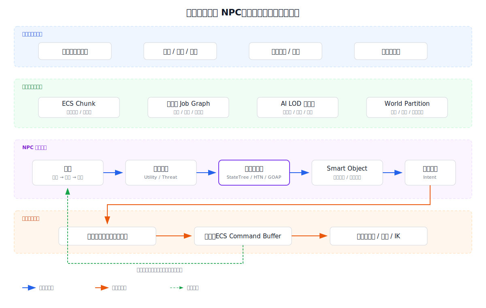
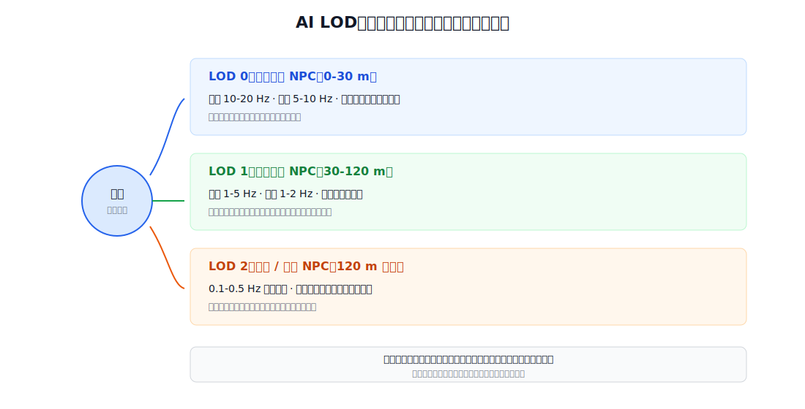
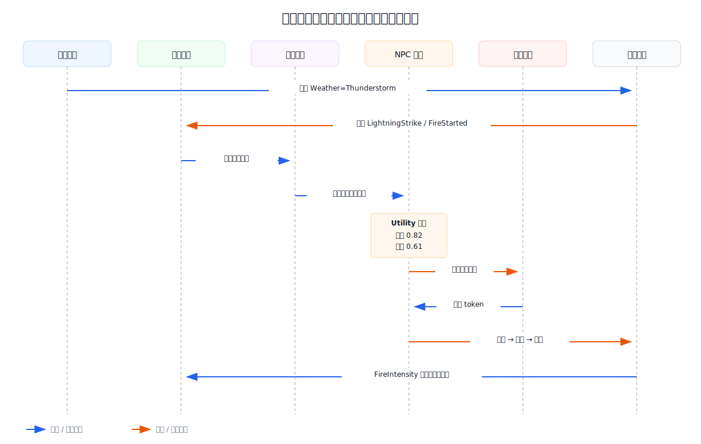

# 现代开放世界 NPC 架构：从数据驱动、分层决策到涌现式世界

开放世界中的 NPC 为什么会显得“活着”？

答案通常不是给每个角色接入一个更聪明的“大脑”，而是让大量简单、可组合的系统共享同一套世界规则：天气改变地表状态，地表状态产生刺激，NPC 感知刺激后重新评估目标，资源系统解决冲突，动画与导航再把结果表现出来。

真正困难的地方有三个：

1. **规模**：世界中可能存在数千个角色，但一帧只有 16.6 ms。
2. **一致性**：多个角色会同时争夺门、椅子、水井、掩体等有限资源。
3. **可信度**：NPC 不仅要做出合理动作，还要让玩家看见原因、过程和后果。

本文以一个可落地的现代架构为主线，从数据布局、感知、决策、调度、世界流送和一致性展开，最后用“雷暴引发村庄火灾”案例把各层串起来。

> 文中的系统名与参数用于解释工程方法，不代表对某款商业游戏内部实现的逆向结论。实际项目会根据引擎、平台和玩法目标做不同取舍。

---

## 1. 先定义目标：NPC 的“智能”到底是什么

### 1.1 玩家感知到的智能，不等于算法复杂度

对玩家而言，一个可信 NPC 通常具备五种能力：

| 能力 | 玩家看到的现象 | 底层要求 |
| --- | --- | --- |
| 感知 | 看见火、听见呼救、记住袭击者 | 空间查询、刺激过滤、记忆衰减 |
| 选择 | 先逃生还是先救人 | `Utility AI`、规则、目标规划 |
| 执行 | 绕开障碍，到水井取水 | 导航、动作控制、动画匹配 |
| 协作 | 不会所有人挤向同一把椅子 | 槽位、租约、仲裁、失败恢复 |
| 延续 | 玩家离开后，世界仍有结果 | 流送、摘要模拟、状态持久化 |

其中任何一层断裂，都会破坏可信度。例如：

- NPC 正确判断要逃跑，却撞在门框上。
- NPC 记得发生过火灾，却在火焰中播放闲聊动画。
- 村民都想救火，却同时“拿到”同一个水桶。
- 玩家离开村庄再回来，火灾和伤亡全部被重置。

因此，**NPC 智能是一个端到端系统属性**，不是单一决策算法的能力。

### 1.2 四类工程指标

设计 NPC 系统时，应同时观察四类指标：

1. **性能指标**：每帧 AI 时间、射线次数、导航查询数、活跃实体数。
2. **行为指标**：目标切换频率、计划失败率、资源争用率、卡死率。
3. **体验指标**：玩家能否理解行为原因，关键事件是否有明显反馈。
4. **生产指标**：策划配置一个新职业、新地点、新互动需要多少时间。

只追求“算法更聪明”，往往会得到难调试、难配置、难稳定运行的系统。

---

## 2. 总体架构：世界先产生事实，NPC 再产生意图

现代开放世界 AI 可以概括为一条闭环：

> **世界状态 → 感知 → 情境评估 → 规划 → 动作意图 → 仲裁与提交 → 新世界状态**



这套架构有两个关键边界。

### 2.1 事实与意图分离

天气、门是否打开、水井是否可用、火焰强度，属于**世界事实**。NPC 想开门、想取水、想逃跑，属于**动作意图**。

决策阶段只生成意图，不直接修改共享世界。统一提交阶段再处理：

- 同一资源被多个 NPC 争用。
- 动作前置条件已经失效。
- NPC 在等待期间死亡、眩晕或被剧情接管。
- 流送边界导致目标对象暂时不可用。

这与数据库中的“读取、计算、提交”相似。它不能消灭所有并发问题，但能把冲突集中在可观察、可测试的边界上。

### 2.2 模拟与表现分离

“村民正在从家前往酒馆”是模拟状态；逐帧脚步、转身、开门和面部表情是表现状态。

近处 NPC 需要完整表现，远处 NPC 只需更新抽象进度。二者分离后，系统才能在不模拟每一块骨骼的前提下，让离屏世界持续演化。

---

## 3. 数据底座：`ECS` 的价值不只是“组件化”

### 3.1 从对象集合转向数据批次

传统面向对象设计常把每个 NPC 表示为一个大对象：

```cpp
class NPC {
public:
    Transform transform;
    Inventory inventory;
    Perception perception;
    Brain brain;

    void Update(float dt);
};
```

问题不在于面向对象本身，而在于大量 NPC 执行 `Update()` 时，会访问散落在内存各处的数据，并走过大量不同分支。CPU 预取和向量化难以发挥作用。

**实体组件系统**（`ECS`）更关注数据布局。具有相同组件组合的实体被放入同一 `Archetype Chunk`，系统按批次遍历：

```text
Archetype: [Transform, Velocity, MoveTarget]

Chunk 17
├── Transform[0..127]
├── Velocity[0..127]
└── MoveTarget[0..127]
```

移动系统只读取 `Transform`、`Velocity` 和 `MoveTarget`。它不需要加载背包、对话或长期记忆。这带来三点收益：

- **缓存友好**：连续读取同类数据。
- **批处理友好**：适合 `SIMD` 和多线程任务。
- **查询明确**：系统声明读写哪些组件，更容易建立任务依赖。

### 3.2 一个可用的 NPC 组件集合

以伐木工为例，可以拆成以下数据：

| 组件 | 核心字段 | 更新频率 |
| --- | --- | --- |
| `Transform` | 位置、朝向、区域 ID | 每帧或按需 |
| `Needs` | 饥饿、疲劳、安全感 | 低频 |
| `PerceptionState` | 当前刺激、置信度 | 中高频 |
| `Memory` | 事件、来源、时间、衰减 | 低频 / 事件触发 |
| `GoalState` | 当前目标、评分、锁定时间 | 决策时 |
| `PlanState` | 当前计划、步骤、失败原因 | 决策时 |
| `Interaction` | 目标对象、槽位、租约 | 事件触发 |
| `SimulationLOD` | 重要度、更新档位 | 低频 |

组件应保存**状态**，系统负责**行为**。例如 `Needs` 不应自己决定“去睡觉”；`UtilitySystem` 读取疲劳值后，计算“休息”目标的分数。

### 3.3 `ECS` 不是万能答案

以下内容通常不适合强行塞入纯 `ECS`：

- 大型不可变资源，如行为树资产和动画图。
- 编辑器工作流中的复杂对象引用。
- 少量、低频、强多态的剧情控制逻辑。

实际项目常采用混合架构：高频批处理数据进入 `ECS`，复杂资产由普通对象管理，组件中保存轻量句柄。

---

## 4. 感知系统：从“附近有什么”到“我相信发生了什么”

### 4.1 三阶段感知管线

让每个 NPC 遍历所有实体会接近 `O(N²)`。更现实的实现是逐级过滤：

1. **粗筛**：使用均匀网格、`BVH`、四叉树或八叉树查询附近候选。
2. **精测**：对候选执行视锥、遮挡射线、声学传播或可达性测试。
3. **认知化**：把物理刺激转换为带置信度、来源和时间戳的事实。

```text
火焰实体
  ↓ 30 米范围查询
候选刺激 Fire_102
  ↓ 视锥 + 遮挡
可见度 0.76
  ↓ 结合角色知识
记忆：仓库方向发生火灾，置信度 0.68，10 秒后开始衰减
```

最后一步很重要。NPC 不应直接读取“上帝视角”的真实状态，而应根据自己的观测形成**主观事实**。

### 4.2 刺激而不是实体

感知系统最好处理统一的**刺激**（`Stimulus`），而不是为火焰、脚步、血迹分别写一条专用链路：

```json
{
  "type": "Fire",
  "source": "Barn_07",
  "position": [128.4, 16.0, 44.2],
  "intensity": 0.86,
  "channels": ["Visual", "Heat", "Sound"],
  "created_at": 1842.35,
  "expires_at": 1854.35
}
```

感知者根据自身能力选择通道：守卫可能对声音敏感，受伤角色可能对威胁刺激提高权重，醉酒角色的视觉置信度则更低。

### 4.3 黑板、事件总线与记忆各自负责什么

这三者经常被混在一起：

| 机制 | 适合保存 | 不适合承担 |
| --- | --- | --- |
| 黑板 `Blackboard` | 当前任务的短期共享上下文 | 全世界永久状态 |
| 事件总线 `Event Bus` | “发生了什么”的通知 | 长期事实查询 |
| 记忆 `Memory` | NPC 认为发生过什么 | 绝对真实的世界状态 |

例如仓库起火：

1. 火焰系统更新 `FireIntensity`。
2. 区域事件流发布 `FireStarted`。
3. 兴趣过滤器只唤醒附近或与任务相关的 NPC。
4. NPC 通过感知确认事件，并写入个人记忆。
5. 决策系统在自己的上下文黑板中记录当前救援目标。

这样既避免所有 NPC 轮询全局键值表，也保留了“有人没看见火灾，因此并不知情”的合理差异。

---

## 5. 决策系统：不同算法解决不同时间尺度的问题

没有一种算法适合包办全部行为。较稳健的做法是分层组合。

### 5.1 反应层：状态机与 `StateTree`

反应层处理毫秒到秒级行为：受击、闪避、转向、开门、播放动作。

- 优点：可预测、成本低、调试直观。
- 缺点：状态和转移过多时容易膨胀。

适合用层次状态机或将选择器与状态机结合的 `StateTree`。它不负责“我今天为什么要去伐木”，而负责“已经决定伐木后，如何走到树边并完成挥斧”。

### 5.2 目标层：`Utility AI`

**效用 AI** 把多个候选目标映射为可比较分数：

```text
Score(goal) = BaseWeight
            × NeedCurve
            × ContextCurve
            × PersonalityBias
            × Feasibility
```

伐木工在雷雨中可能得到：

| 目标 | 基础权重 | 情境修正 | 可行性 | 最终分数 |
| --- | ---: | ---: | ---: | ---: |
| 继续工作 | 0.70 | 0.20 | 0.90 | 0.13 |
| 回家避雨 | 0.60 | 0.95 | 0.95 | 0.54 |
| 帮助灭火 | 0.50 | 0.90 | 0.80 | 0.36 |

真实实现通常会加入：

- **惯性**：新目标必须明显优于当前目标，避免频繁横跳。
- **冷却**：失败目标短时间内降权。
- **承诺窗口**：关键动作执行若干秒后才允许重新评分。
- **人格偏置**：勇敢、利己、守序等参数改变曲线，而不是复制整棵行为树。

### 5.3 计划层：`HTN` 与 `GOAP`

当目标需要多步动作时，再进入规划层。

**分层任务网络**（`HTN`）由设计者提供任务分解方式：

```text
扑灭仓库火灾
├── 获取水源
│   ├── 预约水井槽位
│   ├── 前往水井
│   └── 装满水桶
├── 前往火点
└── 泼水
```

它的优点是计划符合设计意图，适合生产环境。

**基于目标的动作规划**（`GOAP`）则从动作的前置条件和效果中搜索路径：

```text
目标：FireIntensity < 0.2

FillBucket
  pre: HasBucket && NearWater
  effect: BucketFilled

PourWater
  pre: BucketFilled && NearFire
  effect: FireIntensity -= 0.35
```

它更灵活，但搜索空间、可解释性和内容调试成本更高。

常见组合是：

- `Utility AI` 选“做什么”。
- `HTN` 或 `GOAP` 规划“分几步做”。
- `StateTree`、行为树或动作状态机执行“当前这一步怎么做”。

### 5.4 计划必须允许失败

动态世界中，计划失败是常态：门被锁、水井被占、目标死亡、道路坍塌。每个动作都需要明确：

```text
Preconditions  执行前必须成立
Effects        成功后修改什么
FailureReason  为什么失败
Timeout        最长等待多久
Compensation   失败后释放哪些资源
```

失败不应简单地“从头再来”。系统应根据原因选择局部重试、重新规划、切换目标或降级到保底行为。

---

## 6. 智能对象：让环境提供行为，而不是让 NPC 认识所有道具

### 6.1 能力广告模型

**智能对象**（`Smart Object`）把交互能力放在环境对象上。椅子提供“坐下”，水井提供“取水”，掩体提供“躲藏”。NPC 只查询满足目标的能力。

```json
{
  "object_id": "Well_03",
  "capabilities": [
    {
      "action": "CollectWater",
      "required_tags": ["Humanoid", "HasContainer"],
      "effects": {"ContainerFilled": true},
      "slots": [
        {"id": "North", "capacity": 1},
        {"id": "South", "capacity": 1}
      ],
      "lease_seconds": 12
    }
  ]
}
```

新增一种水井时，设计者配置能力和动画对齐点即可，不必修改所有职业的 AI。

### 6.2 槽位、预约与租约

两个 NPC 同时发现一把空椅子时，必须有唯一结果。一个常见协议是：

1. NPC 查询可用槽位，只得到**候选**。
2. NPC 提交 `Reserve(slot, entity, priority)` 意图。
3. 仲裁器按优先级、距离、任务权重和等待时间选出获胜者。
4. 获胜者获得带过期时间的 `lease_token`。
5. 到达槽位后执行 `Commit(token)`。
6. 超时、死亡或取消时自动释放租约。

租约比永久锁更适合动态世界，因为持有者可能被卸载、卡住或中途改变计划。

### 6.3 动画不是最后“贴上去”的

交互对象应同时提供：

- 入口位置与朝向。
- 可用身体姿态与动画标签。
- 手脚接触点和 `IK` 目标。
- 对齐窗口、退出方式和中断规则。

否则逻辑上成功的“坐下”，会表现为角色穿过椅背或瞬移到座位。

---

## 7. 时间与并行：不是所有 NPC 每帧都完整思考

### 7.1 一帧是任务依赖图，不只是固定流水线

为了便于理解，可以把单帧写成以下逻辑顺序：

```text
采集世界变化
    ↓
更新空间索引与刺激
    ↓
感知与记忆
    ↓
目标评估与规划
    ↓
资源仲裁
    ↓
提交状态
    ↓
导航、动画与渲染消费结果
```

但现代引擎通常不会让这些阶段全部在主线程严格串行。它们会被拆成**任务图**（`Job Graph`）：

- 只读任务并行运行。
- 写不同组件的任务可以并行。
- 读写冲突通过依赖边或同步点约束。
- 结构变化写入 `Command Buffer`，在安全点批量提交。

真正应该保证的是**依赖正确与结果可解释**，而不是机械地让每个系统占据固定毫秒区间。

### 7.2 `AI LOD`：按重要度分配预算



`AI LOD` 不应只看距离，还应综合：

```text
Importance = DistanceWeight
           + VisibilityWeight
           + CombatWeight
           + QuestWeight
           + RecentEventWeight
           + PlayerFocusWeight
```

一个离玩家 300 米、但与主线任务相关的角色，可能比 50 米外的普通路人更重要。

调度器在每帧预算内选择要更新的实体：

```cpp
while (budget.HasTime()) {
    Entity e = priorityQueue.PopHighest();
    RunPerceptionOrThink(e);
    e.nextUpdate = now + IntervalFor(e.lod, e.importance);
}
```

为了避免“所有 NPC 每秒同一时刻醒来”，应给更新周期加入稳定抖动，并限制单帧最大唤醒量。

### 7.3 示例预算，而不是固定标准

以 60 FPS、CPU 预算紧张的平台为例，一种起始预算可能是：

| 模块 | 目标预算 | 常用控制手段 |
| --- | ---: | --- |
| 空间与刺激 | 0.4 ms | 批量查询、事件过滤 |
| 感知精测 | 0.8 ms | 射线配额、结果缓存 |
| 目标与规划 | 0.8 ms | 分帧、搜索上限 |
| 导航请求 | 0.6 ms | 异步寻路、路径复用 |
| 仲裁与提交 | 0.3 ms | 批处理、局部锁域 |

这些数字不是行业标准。正确做法是根据目标硬件、场景密度和玩法峰值持续剖析。

---

## 8. 大世界连续性：流送、休眠与摘要模拟

### 8.1 离开玩家视野后，NPC 去了哪里

完整开放世界通常把角色分成三类状态：

1. **激活**：完整实体、导航、动画、感知和碰撞都存在。
2. **休眠**：保留关键组件，停止高频系统更新。
3. **摘要**：只保存职业、位置锚点、库存、关系、任务和日程进度。

远处伐木工不需要真的沿导航网格走 2 公里。摘要模拟可以计算：

```text
08:00 从家出发
08:18 到达林场
08:18-12:00 产出 4 单位木材
12:00 雷暴事件覆盖林场
12:02 日程切换为 ShelterAt(Inn_02)
```

当玩家接近时，系统再把摘要状态**物化**为完整实体。

### 8.2 物化必须满足约束

不能简单地把 NPC 生成在计算位置。系统还要检查：

- 位置是否在可导航区域。
- 玩家是否正在看着该点。
- 目标建筑是否已被摧毁。
- NPC 是否因远场事件受伤、死亡或被捕。
- 当前动作能否从某个合理动画状态进入。

若精确状态无法恢复，应选择附近合法锚点，并播放可解释的过渡，而不是在玩家眼前瞬移。

### 8.3 持久化保存“结果”，不保存所有瞬时细节

存档通常应保存：

- 稳定身份与重要关系。
- 任务、库存、伤亡、建筑状态。
- 对后续玩法有影响的关键记忆。
- 可重建的日程和区域摘要。

不应保存每条射线结果、每个临时刺激或行为树每个节点的瞬时状态。后者既庞大，也容易在版本升级后失效。

---

## 9. 完整案例：雷暴如何演化为一次村庄救援

下面用一个虚构案例串联前文。村庄有 120 名居民，其中玩家附近 18 名处于完整模拟，其余角色处于中低 `AI LOD`。

### 9.1 场景与角色

- 雷暴天气提高金属物体遭雷击的概率。
- 仓库屋顶为木质，具有 `Flammable` 标签。
- 水井提供两个 `CollectWater` 交互槽位。
- 村民阿岚具有 `Brave=0.8`、`Community=0.7`、`Injured=0.1`。
- 村民伯特具有 `Brave=0.3`、`Community=0.4`、`Injured=0.5`。



### 9.2 阶段一：世界产生事实

雷击命中仓库避雷设施附近的金属构件。元素反应系统执行：

```text
Lightning + Metal  → Heat + ElectricCharge
Heat + Flammable   → Burning
Burning            → Smoke + Light + Heat + CrackleSound
```

这一步不需要知道“村民应该来救火”。它只负责统一的材料和状态规则。

世界状态随后更新：

```json
{
  "entity": "Barn_07",
  "state": "Burning",
  "fire_intensity": 0.72,
  "structural_integrity": 0.91
}
```

区域事件流发布 `FireStarted(Barn_07)`。远离村庄、无任务关系的 NPC 不会被唤醒。

### 9.3 阶段二：不同 NPC 得到不同认识

阿岚在 25 米外，能够看见烟和火光，也能听到呼救。他的感知记录为：

```text
Fire at Barn_07
confidence = 0.91
threat = 0.76
known_victims = 1
```

伯特在石墙后，只听到钟声，没有确认火点：

```text
Emergency near VillageCenter
confidence = 0.48
threat = 0.55
```

因此两人不必做出相同决定。差异来自感知、记忆、身体状态和人格参数，而不是随机播放两段动画。

### 9.4 阶段三：目标评分与计划生成

阿岚的候选目标：

| 目标 | 需求与人格 | 情境 | 风险 | 可行性 | 得分 |
| --- | ---: | ---: | ---: | ---: | ---: |
| 救火 | 0.86 | 0.95 | 0.78 | 0.91 | 0.82 |
| 疏散儿童 | 0.72 | 0.88 | 0.90 | 0.70 | 0.66 |
| 自行逃生 | 0.41 | 0.80 | 0.95 | 1.00 | 0.61 |

系统选择“救火”，`HTN` 将其分解为：

1. 找到容器。
2. 预约水井槽位。
3. 取水。
4. 前往安全泼水点。
5. 泼水并重新评估火势。

伯特因伤势较重，救火的风险修正更低，最终选择“向广场疏散”。这让群体行为呈现分工，而不是全员复制同一决策。

### 9.5 阶段四：仲裁让协作成立

阿岚和另一位村民同时预约水井北侧槽位。仲裁器收到：

```text
Intent A: entity=Alan, slot=North, priority=0.82, distance=14m
Intent B: entity=Cora, slot=North, priority=0.76, distance=6m
```

若只按距离，Cora 获胜；若阿岚正在执行主线救援任务，任务权重可能让阿岚获胜。无论策略如何，结果必须唯一，并返回明确失败原因：

```text
Alan  → ReservationGranted(token=R731, ttl=12s)
Cora  → ReservationRejected(reason=SlotOccupied)
```

Cora 不会原地等待。她查询第二槽位，若仍失败，则切换为“搬运伤员”。

### 9.6 阶段五：反馈形成涌现

阿岚泼水后，火焰强度从 `0.72` 降到 `0.43`。火焰系统随之降低烟量，结构系统延后坍塌时间，感知系统让附近 NPC 更新风险评估。

随后可能出现新的链式结果：

- 烟量降低，守卫看见被困者，转向救援。
- 水井排队过长，部分村民改从河边取水。
- 仓库库存被烧毁，几天后木材价格上涨。
- 阿岚因救援成功获得新的关系记忆和声望。

这就是**涌现式设计**：设计者定义统一规则、边界和反馈，具体故事由系统在运行时组合出来。

---

## 10. 更前沿的方向：大模型可以加入哪里

大语言模型为 NPC 带来了自然语言理解、开放式对话和知识归纳能力，但它不适合直接接管每帧控制。

### 10.1 适合交给大模型的任务

- 根据结构化事实生成符合身份的对话。
- 把长期事件压缩成可检索的记忆摘要。
- 将玩家自然语言映射为有限的游戏意图。
- 为低频社会行为生成候选目标或解释文本。
- 在开发期生成行为变体和测试场景。

### 10.2 不适合直接交给大模型的任务

- 逐帧移动、射击、碰撞和动画控制。
- 权威世界状态修改。
- 资源锁与多人同步裁决。
- 必须稳定复现的任务流程。
- 高频、大规模 NPC 的实时推理。

可靠架构应把模型限制在**提议层**：

```text
结构化世界事实
    ↓
LLM 生成候选意图 / 对话
    ↓
规则校验与权限过滤
    ↓
确定性执行系统
    ↓
权威世界状态
```

例如模型可以提议 `HelpVictim(Victim_12)`，但只有规则系统确认角色知情、路径可达、动作允许后，才能进入执行层。

### 10.3 记忆检索比“无限上下文”更重要

NPC 长期记忆可以拆成：

| 记忆类型 | 示例 | 检索依据 |
| --- | --- | --- |
| 情景记忆 | “阿岚在火灾中救过我” | 人物、地点、情绪、时间 |
| 语义记忆 | “北门夜间关闭” | 事实主题、置信度 |
| 社会记忆 | 信任 0.7、畏惧 0.2 | 关系对象 |
| 程序记忆 | 如何完成取水流程 | 技能 / 行为资产 |

模型不需要读取全部历史。系统应先按当前人物、地点和目标检索少量相关记忆，再组装受约束上下文。

### 10.4 前沿不等于无约束

生产环境必须额外处理：

- 延迟与超时降级。
- 内容安全与角色设定一致性。
- 提示注入和玩家诱导越权。
- 推理成本与缓存。
- 存档兼容和行为可复现性。
- 线上问题的审计记录。

大模型应增强表达和低频推理，而不是绕开已有的世界规则。

---

## 11. 可观测性：没有调试工具，就没有复杂 NPC

复杂行为必须能回答“为什么”。建议为每个 NPC 提供可视化调试面板：

```text
Entity: Alan_0042
LOD: 0
Perceived: Fire(Barn_07, confidence=0.91)
Current Goal: ExtinguishFire(score=0.82)
Current Plan: FetchWater > MoveToFire > PourWater
Current Step: Reserve(Well_03.North)
Lease: R731, expires in 8.4s
Last Failure: PathBlocked(Door_12)
```

至少应记录以下数据：

- 本帧为什么被调度。
- 看见、听见和忽略了什么。
- 候选目标及分数组成。
- 计划为何成功或失败。
- 谁占用了目标资源。
- 哪个系统最后修改了关键组件。

线上回放可以只记录高层事件和随机种子。在确定性要求较高的系统中，还应固定任务提交顺序，避免并行执行导致难以复现的差异。

---

## 12. 落地路线：先建立闭环，再增加聪明程度

### 12.1 第一阶段：做出可验证的最小闭环

1. 建立实体、组件和统一事件格式。
2. 完成空间粗筛与一种视觉刺激。
3. 使用简单 `Utility AI` 选择目标。
4. 通过智能对象完成一次预约与交互。
5. 提供 NPC 决策调试面板。

验收标准：20 个 NPC 能对火灾做出不同但可解释的反应，且不会重复占用同一槽位。

### 12.2 第二阶段：扩大规模

1. 引入任务图和批处理查询。
2. 增加 `AI LOD`、分帧和射线配额。
3. 增加休眠与摘要模拟。
4. 建立压力场景和性能基线。

验收标准：目标硬件上维持规定帧率，峰值事件中 AI 预算不持续超限，关键 NPC 不因降级失去响应。

### 12.3 第三阶段：增加涌现深度

1. 扩展材料、状态和反应规则。
2. 增加记忆、关系与群体角色。
3. 引入 `HTN` 或受限 `GOAP`。
4. 让远场事件产生可持久化后果。

验收标准：同一场景在不同天气、资源和人物组合下产生多种合理结果，并可通过日志解释全过程。

### 12.4 第四阶段：谨慎接入生成式 AI

1. 先用于离线内容生成和测试。
2. 再用于受约束的对话与记忆摘要。
3. 所有动作提议经过规则校验。
4. 建立超时、缓存、审计与降级路径。

验收标准：模型不可直接修改权威状态；模型不可用时，核心玩法仍完整运行。

---

## 13. 结语

可信的开放世界 NPC，不是“每个角色都有一个昂贵的大脑”，而是以下工程能力共同作用的结果：

- `ECS` 和任务图让大规模状态更新足够高效。
- 感知、事件与记忆让角色只依据自己知道的事实行动。
- `Utility AI`、`HTN`、`GOAP` 与状态控制器覆盖不同决策尺度。
- 智能对象、槽位和租约解决环境交互与资源冲突。
- `AI LOD`、世界流送和摘要模拟让有限预算支撑大世界连续性。
- 统一材料规则和反馈链条让系统产生可解释的涌现。
- 大模型在受约束的提议层增强表达，而不破坏确定性执行。

当这些层次形成闭环后，一个普通的天气变化就不再只是视觉特效。它会成为世界事实，触发感知与记忆，改变目标与计划，引发资源争用和群体协作，并在玩家离开后继续留下后果。动态世界的生命感，正来自这种可计算、可观察、可延续的因果关系。

---

## 附录：专有名词与术语索引

本表汇总文中出现的专有名词、英文缩写与术语，按概念域分组，每条给出英文全名或同义词、简要释义，以及主要出现的章节，便于回查。

### A. 数据与执行模型

| 术语 | 全名 / 同义 | 释义 | 文中位置 |
| --- | --- | --- | --- |
| `ECS` | Entity-Component System（实体-组件-系统） | 一种以数据布局为中心的运行时架构：实体是 ID，组件是纯数据，系统按组件批处理遍历逻辑。 | §3 |
| `Archetype` / `Archetype Chunk` | Archetype（原型），Archetype Chunk（原型块） | ECS 中，组件组合相同的实体归入同一原型；同一原型的组件按 `SoA`（Structure of Arrays）连续存放在 Archetype Chunk 中，便于缓存与向量化。 | §3.1 |
| `SoA` / 数据批次 | Structure of Arrays（结构数组） | 将同类字段连续存放的内存布局，与 `AoS`（Array of Structures）相对；ECS Chunk 即采用 SoA 风格以提升 SIMD 与缓存命中率。 | §3.1 |
| `SIMD` | Single Instruction, Multiple Data（单指令多数据流） | CPU 一条指令同时作用于多个数据元素的并行模式；NPC 系统常借此并行处理变换、动画或感知向量。 | §3.1, §7.1 |
| `Job Graph` / `Task Graph` | Job Graph / Task Graph（任务依赖图） | 现代引擎将一帧拆成有依赖边的小任务，由调度器按依赖关系并行执行；不是固定流水线。 | §7.1 |
| `Command Buffer` | Command Buffer（命令缓冲） | 把结构性变更（如组件增删、实体创建）先写入缓冲，到安全点批量提交；用于消除并行期间的结构变化冲突。 | §7.1 |

### B. 感知与空间查询

| 术语 | 全名 / 同义 | 释义 | 文中位置 |
| --- | --- | --- | --- |
| `BVH` | Bounding Volume Hierarchy（层次包围体） | 一种空间索引结构，用嵌套包围体加速射线、最近点、视锥等查询。 | §4.1 |
| 均匀网格 | Uniform Grid | 把空间划分成等大单元格的简易空间索引，适合多数开放世界的感知粗筛。 | §4.1 |
| 四叉树 / 八叉树 | Quadtree / Octree | 按平面或三维空间递归四分的索引结构，用于区域查询与粗筛。 | §4.1 |
| 视锥 / 遮挡射线 | View Frustum / Occlusion Raycast | 视锥确定角色可视方向，遮挡射线检测目标是否被阻挡；两者常组合用于感知精测。 | §4.1, §4.2 |
| `Stimulus` / 刺激 | Stimulus（刺激） | 感知系统的统一输入格式，包含类型、来源、强度、通道、时间戳等；NPC 据此过滤与认知化。 | §4.2 |
| 通道（感知通道） | Perceptual Channel | 视觉、听觉、嗅觉、触觉等感官维度；同一事件可被多个通道接收，置信度不同。 | §4.2 |

### C. 通信与上下文机制

| 术语 | 全名 / 同义 | 释义 | 文中位置 |
| --- | --- | --- | --- |
| `Blackboard` | Blackboard（黑板） | 当前任务的短期共享上下文，存放协作中的中间事实；适合保存“这一轮救援的目标是谁”。 | §4.3 |
| `Event Bus` | Event Bus（事件总线） | 一对多的“事件发生了什么”通知通道；适合触发响应，不适合承担长期事实查询。 | §4.3 |
| `Memory` / 记忆 | Memory（含情景/语义/社会/程序记忆） | NPC 主观认为发生过什么。分为情景（事件体验）、语义（事实）、社会（关系值）、程序（技能流程）四类。 | §4.3, §10.3 |
| 记忆衰减 | Memory Decay | 随时间降低旧记忆的置信度，避免过时的 NPC 行为。 | §1.1, §4.2 |

### D. 决策与规划算法

| 术语 | 全名 / 同义 | 释义 | 文中位置 |
| --- | --- | --- | --- |
| 反应层 | Reactive Layer | 毫秒到秒级行为层：受击、闪避、开门、播放动作。 | §5.1 |
| `FSM` / 状态机 | Finite State Machine（有限状态机） | 用有限状态与显式转移表描述行为的控制器，可预测、易调试，但转移多时易膨胀。 | §5.1 |
| `Behavior Tree` / 行为树 | Behavior Tree（行为树） | 用选择器、序列、装饰器等节点组合行为的树形控制器；执行“当前这一步怎么做”。 | §5.3 |
| `StateTree` | State Tree（状态树） | 将选择器与状态机结合的现代控制器；既描述宏观决策，又管理状态和转移。 | §5.1, §5.3 |
| `Utility AI` / 效用 AI | Utility-based AI | 把多个候选目标按曲线加权打分，比较分数选出当前最佳目标。 | §1.1, §5.2 |
| `NeedCurve` / `ContextCurve` / `PersonalityBias` / `Feasibility` | Utility 曲线的四类乘子 | 需求曲线（当前生理/情绪状态）、情境曲线（环境与人际上下文）、人格偏置（勇敢/利己/守序等）、可行性（路径/资源/体力是否允许）。 | §5.2 |
| 惯性 / 冷却 / 承诺窗口 | Inertia / Cooldown / Commitment Window | Utility 的稳定化机制：新目标必须明显更优、失败目标短时间内降权、关键动作执行若干秒后才允许重评分。 | §5.2 |
| `HTN` | Hierarchical Task Network（分层任务网络） | 由设计者提供任务分解方式，把复合目标逐层拆成原子动作；可解释、便于生产。 | §5.3, §9.4 |
| `GOAP` | Goal-Oriented Action Planning（基于目标的动作规划） | 从动作的前置条件与效果中正向/反向搜索动作链，得到多步计划；灵活但搜索成本与调试难度更高。 | §5.3 |
| `Preconditions` / `Effects` / `FailureReason` / `Timeout` / `Compensation` | 规划元字段 | 每个动作显式声明：执行前条件、产生的效果、失败原因、最长等待、失败补偿（释放哪些资源）。 | §5.4 |

### E. 世界对象与资源仲裁

| 术语 | 全名 / 同义 | 释义 | 文中位置 |
| --- | --- | --- | --- |
| `Smart Object` / 智能对象 | Smart Object（智能对象） | 把交互能力放在场景对象上的设计模式：能力广告 + 入口位置 + 动画对齐点 + 槽位租约。 | §6.1 |
| 能力广告 | Capability Advertisement | 智能对象对外发布“我能提供什么动作、需要什么标签”的元数据；NPC 按能力检索而非枚举对象类型。 | §6.1 |
| 槽位 | Slot | 智能对象上同时仅允许有限 NPC 占用的位点，如水井的“取水口”、椅子的“坐位”。 | §1.1, §6.2 |
| 预约 / 仲裁 / 租约 | Reservation / Arbitration / Lease | 三段式协议：NPC 提交预约意图 → 仲裁器按优先级/距离/任务权重选唯一胜者 → 胜者获得带过期时间的租约凭证。 | §1.1, §6.2, §9.5 |
| `lease_token` | Lease Token（租约凭证） | 带 TTL 的使用权凭证；超时、取消或持有者失效即自动释放，适合动态世界中的并发协调。 | §6.2 |
| `SlotOccupied` 等失败原因 | Reservation Rejection Reason | 仲裁返回的明确原因码；用于驱动 NPC 切换备选策略，而不仅仅返回“失败”。 | §9.5 |

### F. 动画与表现

| 术语 | 全名 / 同义 | 释义 | 文中位置 |
| --- | --- | --- | --- |
| `IK` / 逆运动学 | Inverse Kinematics | 根据末端目标（如抓握点、对齐点）反算中间关节姿态的技术，常见于坐下、抓取、攀爬。 | §6.3 |
| 动画对齐点 / 入口姿态 | Animation Alignment / Entry Pose | 智能对象为正确交互提供的空间对齐、姿态与中断规则，避免穿模或瞬移。 | §6.3 |
| 模拟与表现分离 | Simulation vs Presentation | 抽象进度 vs 逐帧表现分层：近处 NPC 完整表现，远处 NPC 只更新进度；是大世界连续性的基础。 | §2.2, §8 |

### G. 调度、规模与连续性

| 术语 | 全名 / 同义 | 释义 | 文中位置 |
| --- | --- | --- | --- |
| `AI LOD` | AI Level of Detail（AI 细节等级） | 按距离、可见性、战斗、任务、近事件、玩家焦点等综合重要度，给不同 NPC 分配不同更新频率与子系统开关。 | §7.2, §12 |
| 重要性评分 | Importance Score | 综合 `DistanceWeight`、`VisibilityWeight`、`CombatWeight`、`QuestWeight`、`RecentEventWeight`、`PlayerFocusWeight` 等维度得到的综合调度优先级。 | §7.2 |
| 抖动 / 单帧最大唤醒量 | Jitter / Wake Budget | 为避免 NPC “齐步走”同时苏醒的稳定化手段；限制单帧最多唤醒数量，并对更新周期加入随机抖动。 | §7.2 |
| 异步寻路 / 路径复用 | Asynchronous Pathfinding / Path Reuse | 把寻路请求移到工作线程，并对常用路径做缓存，以稳定导航请求的 CPU 预算。 | §7.3 |
| 命令流 / 区域事件流 | Regional Event Stream | 按区域分发的世界事件通道；兴趣过滤器只唤醒与该事件相关的 NPC，避免全表轮询。 | §4.3, §9.2 |
| 流送 / 物化 | Streaming / Materialization | 大世界中把远场 NPC 序列化为摘要、需要时再以合理约束重建为完整实体的机制。 | §8.1, §8.2 |
| 摘要模拟 | Summary Simulation | 只对职业、位置锚点、库存、关系、任务、日程等高层字段做离线推进的低成本模拟。 | §8.1, §8.3 |
| 持久化 / 存档 | Persistence / Save | 保存稳定身份、任务、库存、伤亡、建筑、关键记忆与可重建日程；不存每条射线与每个行为树节点的瞬时状态。 | §8.3, §10.4 |

### H. 涌现与材料规则

| 术语 | 全名 / 同义 | 释义 | 文中位置 |
| --- | --- | --- | --- |
| 元素反应 / 材料规则 | Elemental Reaction / Material Rule | 统一的世界机制层：如 `Lightning + Metal → Heat + ElectricCharge`、`Heat + Flammable → Burning`；不为某个 NPC 写特例。 | §9.2 |
| 涌现式设计 | Emergent Design | 设计者定义统一规则、边界和反馈，玩家在运行时观察到的具体故事由系统组合生成。 | §9.6 |
| 反馈链 / 连锁结果 | Feedback Chain | 一个系统输出作为另一个系统输入形成的因果链条，如灭火降低烟量，影响他人风险评估与救援决策。 | §9.6 |

### I. 大模型与提议层

| 术语 | 全名 / 同义 | 释义 | 文中位置 |
| --- | --- | --- | --- |
| `LLM` | Large Language Model（大语言模型） | 大语言模型；本文特指用于 NPC 的语言/推理模型。 | §10 |
| 提议层 | Proposal Layer | LLM 只输出“候选意图/对话”，由规则校验与确定性系统决定是否真正执行，从而保全权威世界状态。 | §10.2 |
| 提示注入 | Prompt Injection | 来自玩家输入或外部内容对模型提示的越权操纵；必须在生成式 AI 集成中显式防御。 | §10.4 |
| 受约束上下文 | Constrained Context | 仅检索少量相关记忆并组装后送入模型，而非输入全部历史；控制延迟、成本与一致性。 | §10.3 |
| 情景/语义/社会/程序记忆 | Episodic / Semantic / Social / Procedural Memory | 见上文 §C `Memory`；长期记忆检索按当前人物、地点、目标筛选并组装。 | §10.3 |

### J. 可观测性与确定性

| 术语 | 全名 / 同义 | 释义 | 文中位置 |
| --- | --- | --- | --- |
| 调试面板 | Debug HUD / Inspector | 可视化呈现某 NPC 当前 LOD、感知、目标、计划、当前步骤、租约、最近失败等。 | §11 |
| 随机种子 | Random Seed | 录制回放或定位问题时固定的随机源；线上回放只记录高层事件与种子。 | §11 |
| 确定性提交顺序 | Deterministic Submission Order | 在多人或回放敏感系统中固定任务提交顺序，避免并行导致难以复现的差异。 | §11 |

> 说明：以上各条均为本文语境下的概念性释义；具体实现参数、引擎 API 与商业项目内部细节请以所用引擎（`Unity DOTS` / `Unreal Mass` / `Bevy` 等）的官方文档为准。文中系统名与参数用于解释工程方法，不代表对任何商业游戏内部实现的逆向结论。
