# iota-cockpit 系统原理与用户指南

本文档结合 `iota-cockpit` 项目的真实代码实现与 12 张完整架构/流程图表，图文并茂地全面解析智能座舱仿真与评测系统的工作原理、模块交互、物理模型、智能体机制与操作指南。

---

## 目录

1. [系统概述与整体架构](#1-系统概述与整体架构)
2. [数字孪生物理模型](#2-数字孪生物理模型)
3. [仿真 Tick 执行管线](#3-仿真-tick-执行管线)
4. [智能体系统与 OpenWorld 运行时](#4-智能体系统与-openworld-运行时)
5. [场景驱动、故障注入与影响规则](#5-场景驱动故障注入与影响规则)
6. [代码调用链路与 IPC 协议](#6-代码调用链路与-ipc-协议)
7. [不可变录制与独立评估平面](#7-不可变录制与独立评估平面)
8. [Desktop (Tauri 2) 客户端架构](#8-desktop-tauri-2-客户端架构)
9. [十个标杆场景实战指南](#9-十个标杆场景实战指南)

---

## 1. 系统概述与整体架构

`iota-cockpit` 是一个专为智能座舱多智能体人机交互（HMI）、安全干预与自主系统测试设计的决定性仿真与独立评测引擎。系统采用**Ground Truth 仿真内核与独立评测平面彻底隔离**的设计范式。

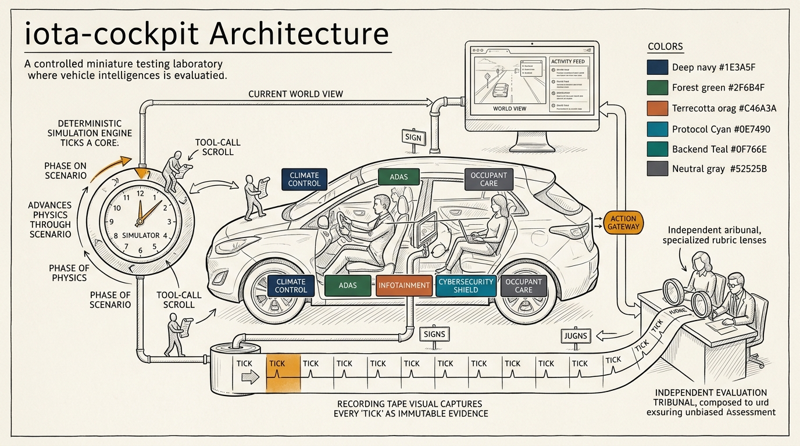

### 1.1 分层架构与组件依赖

整个系统自上而下划分为 4 个严格约束依赖方向的层级：

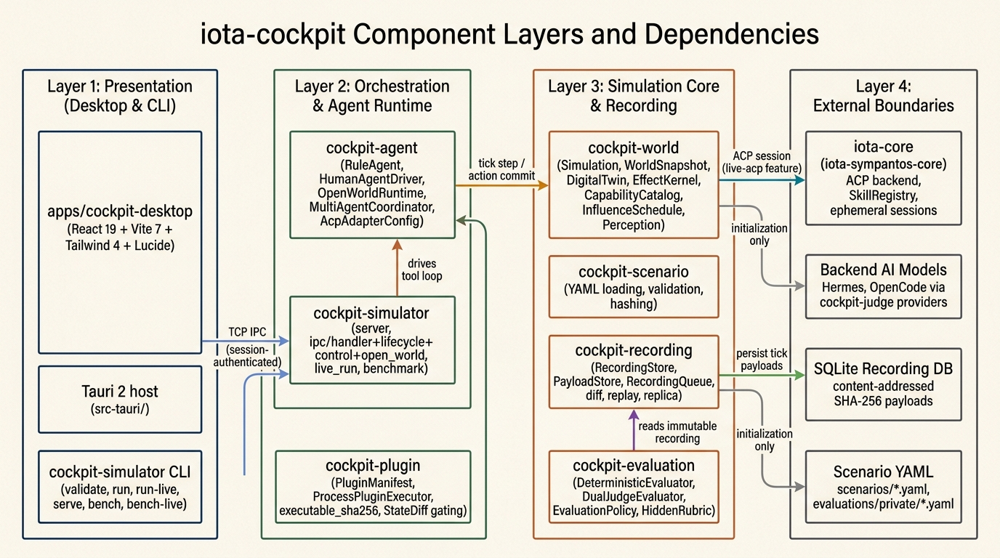

1. **Presentation (桌面与 CLI 层)**：
   - [apps/cockpit-desktop](file:///Users/han/codingx/abc/iota-cockpit/apps/cockpit-desktop)：基于 React 19 + Vite 7 + Tailwind 4 的 Tauri 2 桌面客户端。
   - `cockpit-simulator CLI`：命令行入口，支持 `validate`, `run`, `run-live`, `serve`, `bench`, `bench-live`, `mcp-bridge` 等命令。
2. **Orchestration & Agent Runtime (编排与 Agent 运行时层)**：
   - `cockpit-agent`：提供离线确定性 [RuleAgent](file:///Users/han/codingx/abc/iota-cockpit/crates/cockpit-agent/src/policy.rs) 与在线 Live ACP 后端适配器 `IotaCoreAcpAdapter`，管理多乘员会话 [OpenWorldRuntime](file:///Users/han/codingx/abc/iota-cockpit/crates/cockpit-agent/src/open_world.rs)。
   - `cockpit-simulator`：服务器进程，处理 IPC 请求、生命周期管理与事件分发。
   - `cockpit-plugin`：外置进程插件执行器 [ProcessPluginExecutor](file:///Users/han/codingx/abc/iota-cockpit/crates/cockpit-plugin/src/executor.rs)，实施沙箱隔离与 `executable_sha256` 校验。
3. **Simulation Core & Recording (仿真核心与不可变录制层)**：
   - [cockpit-world](file:///Users/han/codingx/abc/iota-cockpit/crates/cockpit-world/src/lib.rs)：纯粹的决定性物理/状态演化内核，包含 `Simulation`、`WorldSnapshot`（14 域状态）、`DigitalTwin`（RC 热力学与气体质量守恒）、`EffectKernel` 与 `Perception`。
   - `cockpit-scenario`：YAML 场景解析、校验与 SHA-256 哈希计算。
   - `cockpit-recording`：基于 SHA-256 内容寻址的不可变录制存储 `RecordingStore` 与 `PayloadStore`。
4. **External Boundaries (外部边界层)**：
   - `iota-core`：ACP 协议后端与技能注册表（仅在 `live-acp` 开启时调用）。
   - SQLite 录制数据库：持久化 Tick 增量数据。

### 1.2 完整运行时架构

下图展现了各模块在实际运行时的交互流、IPC 契约以及 12 步典型执行序列：

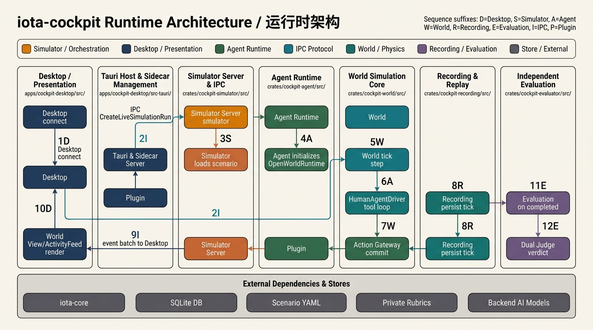

- **执行序列**：
  1. `1D` Desktop 发起连接；
  2. `2I` IPC 发送 `CreateLiveSimulationRun`；
  3. `3S` Simulator 加载场景；
  4. `4A` Agent 初始化 `OpenWorldRuntime` 人物会话；
  5. `5W` Simulation 内核推进 9 阶段 Tick；
  6. `6A` `HumanAgentDriver` 触发人物工具循环；
  7. `7W` Action Gateway 提交 Typed Action；
  8. `8R` Recording 线程异步持久化不可变 Payload；
  9. `9I` IPC 批次推送到 Desktop；
  10. `10D` Desktop 渲染 WorldView 与 ActivityFeed；
  11. `11E` 仿真完成后触发 `cockpit-evaluator`；
  12. `12E` Dual Judge（确定性规则 + 双 AI 判官）输出独立评测报告。

---

## 2. 数字孪生物理模型

`iota-cockpit` 内置了经过实验数据拟合校准的耦合双区车辆物理与乘员生理学模型 [crates/cockpit-world/src/digital_twin.rs](file:///Users/han/codingx/abc/iota-cockpit/crates/cockpit-world/src/digital_twin.rs)。

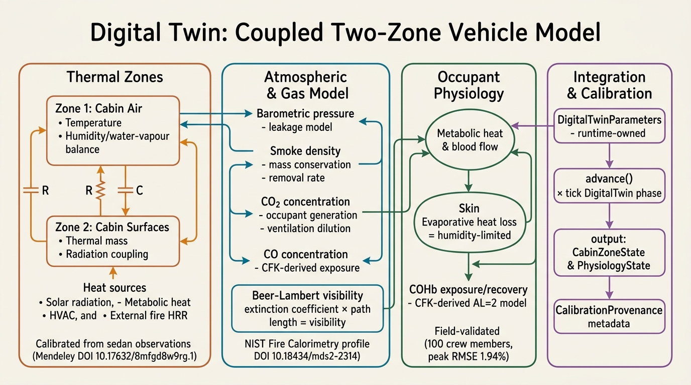

### 2.1 物理建模四大维度

1. **热力学 RC 耦合双区网路 (Thermal Zones)**：
   - 划分为 **Zone 1 (Cabin Air)** 与 **Zone 2 (Cabin Surfaces)**，结合热容 $C$ 与热阻 $R$ 计算传热。
   - 引入太阳辐射、乘员代谢热、HVAC 功耗以及外部火源 HRR（热释放速率）输入。
   - 基于 1,302 组封闭轿车观测数据拟合（Mendeley DOI: 10.17632/8mfgd8w9rg.1），30% 递归留出法 RMSE 达到 2.0269°C（优于基线 2.9161°C）。
2. **大气与气体质量守恒 (Atmospheric & Gas Model)**：
   - 气压与座舱泄漏模型，动态更新 $CO_2$（乘员呼吸产生与通风稀释）、$CO$（燃烧生成）与烟雾质量浓度。
   - 依据 Beer-Lambert 定律由光消光系数与光路长度计算能见度距离。
   - 引入 NIST Fire Calorimetry（DOI: 10.18434/mds2-2314）6,468 行真实火灾 HRR 追溯数据。
3. **乘员两节点体温调节与毒理学 (Occupant Physiology)**：
   - **Core Node** 与 **Skin Node** 能量平衡，计算受湿度限制的出汗蒸发散热。
   - 依据 Coburn-Forster-Kane (CFK) 方程计算血红蛋白碳氧结合率（$COHb\%$）蓄积与恢复。
   - 经过 100 名装甲车乘员实测数据验证，峰值 RMSE 仅 1.94%。
4. **运行参数与标定溯源 (Integration & Calibration)**：
   - 物理参数独立置于 `DigitalTwinParameters`（由运行时掌控，不允许在场景 YAML 中篡改）。
   - 每次 Tick 步进时产生 `CalibrationProvenance` 元数据，确保物理演化的科学性与确定性。

---

## 3. 仿真 Tick 执行管线

仿真内核 [crates/cockpit-world/src/simulation/tick.rs](file:///Users/han/codingx/abc/iota-cockpit/crates/cockpit-world/src/simulation/tick.rs) 严格按固定的 9 阶段顺序（`TICK_PHASE_ORDER`）推进状态演化：

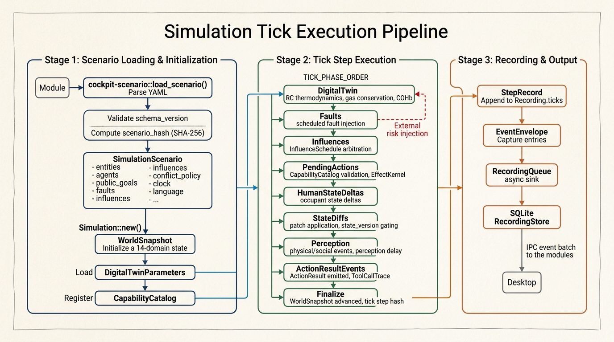

### 3.1 9 阶段顺序详解

```rust
pub const TICK_PHASE_ORDER: [TickPhase; 9] = [
    TickPhase::DigitalTwin,
    TickPhase::Faults,
    TickPhase::Influences,
    TickPhase::PendingActions,
    TickPhase::HumanStateDeltas,
    TickPhase::StateDiffs,
    TickPhase::Perception,
    TickPhase::ActionResultEvents,
    TickPhase::Finalize,
];
```

1. **DigitalTwin**：推进 RC 热力学、气体质量守恒与乘员体温调节，更新 14 域座舱物理状态。
2. **Faults**：在指定 `at_tick` 注入计划内的故障（传感器降级、设备失效等）。
3. **Influences**：`InfluenceSchedule` 收集到期规则，由 `ConflictPolicy` 仲裁解决状态冲突。
4. **PendingActions**：通过 `CapabilityCatalog` 校验 Action 权限，由 `EffectKernel` 执行 Typed Action。
5. **HumanStateDeltas**：应用乘员生理与需求状态变化。
6. **StateDiffs**：应用插件或影响规则的补丁，校验 `state_version` 保证无竞态条件。
7. **Perception**：将物理/社交事件装载至感知队列，应用 `perception_delay_ticks` 延迟分发。
8. **ActionResultEvents**：发出 `ActionResult` 并记录 `ToolCallTrace`。
9. **Finalize**：推进 `WorldSnapshot`，递增 `state_version`，输出当前 Tick 的哈希印记 `TickPhaseHash`。

---

## 4. 智能体系统与 OpenWorld 运行时

智能体系统支持确定性离线规则引擎（RuleAgent）与在线 ACP 语言模型智能体（LiveAgent）。

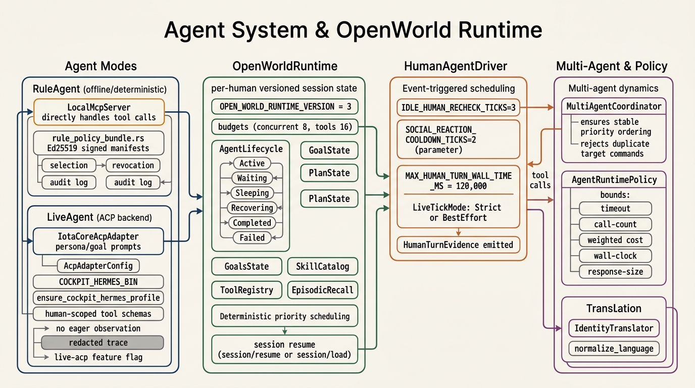

### 4.1 双模式智能体架构

- **RuleAgent (离线确定性)**：
  - 本地 `LocalMcpServer` 直接响应 Tool Call，无需大语言模型。
  - 基于 Ed25519 签名的 `rule_policy_bundle.rs` 策略包，确保 100% 可重复验证。
- **LiveAgent (ACP 后端适配)**：
  - 通过 `IotaCoreAcpAdapter` 封装 ACP 协议，支持 Hermes、OpenCode 等模型。
  - 人物视角受到受限 Schema 约束，无全局视角（No Eager World Observation），必须按需调用感知工具。

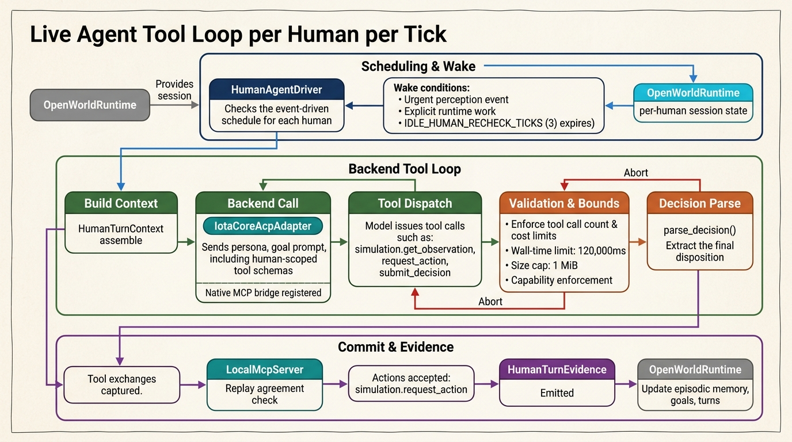

### 4.2 人物工具循环 (Tool Loop) 机制

在 Live 模式下，[HumanAgentDriver](file:///Users/han/codingx/abc/iota-cockpit/crates/cockpit-agent/src/live/human_driver.rs) 在每个 Tick 内为乘员执行交互循环：

1. **唤醒调度**：非每个 Tick 均激活模型。唤醒条件包含紧急感知事件、显式任务，或未唤醒持续达 `IDLE_HUMAN_RECHECK_TICKS = 3`。社交发言设有 `SOCIAL_REACTION_COOLDOWN_TICKS = 2` 的冷却期。
2. **上下文构建与安全约束**：
   - 限制单次 Turn 最大墙钟时间 `MAX_HUMAN_TURN_WALL_TIME_MS = 120,000`。
   - 限制单次响应大小 `1 MiB`，严格执行加权工具 Cost 与 Call-Count 上限。
3. **双侧重放验签 (Replay Agreement)**：
   - 所有的 Native MCP 调用会在本地 `LocalMcpServer` 重放比对。若结果不一致，则触发 Safe Abort，防止非法状态篡改。

---

## 5. 场景驱动、故障注入与影响规则

仿真场景由 YAML 描述，系统严格施行**仿真目标与评测目标分离**的契约设计。

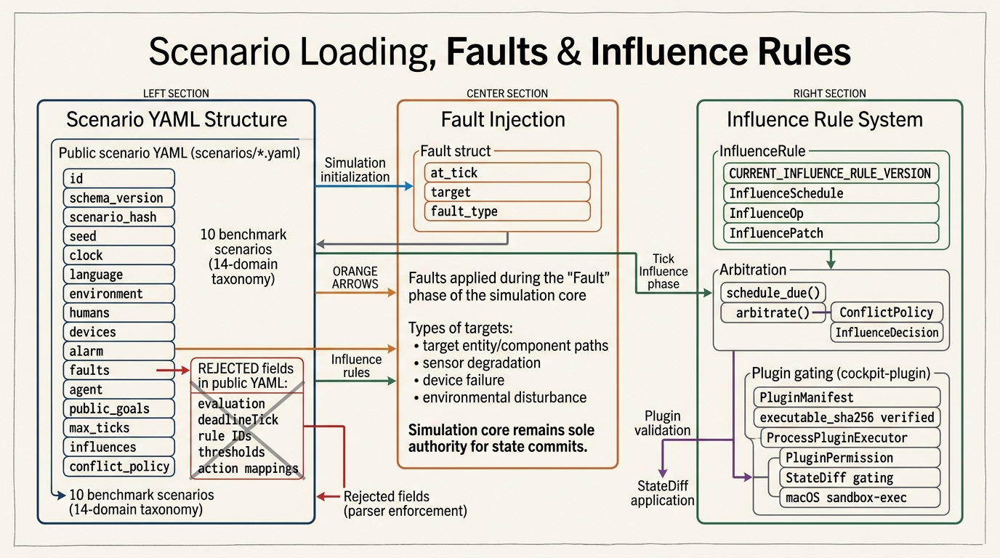

### 5.1 YAML 解析与契约隔离

- **公开场景 (`scenarios/*.yaml`)**：
  - 仅包含初始座舱状态、乘员 Persona、设备状态、显式 `faults` 注入、`influences` 规则与非计分的仿真目标 `public_goals`。
  - ** parser 严格拒签**：若公开 YAML 中包含 `evaluation`、`rule_id`、`threshold` 或评分权重，系统直接报错拒绝加载。
- **私有 Rubric (`evaluations/private/*.yaml`)**：
  - 仅存放于独立评测目录，包含确定性 Rule 逻辑、隐藏 Rubric 和判官提示词，模型在仿真阶段完全无法感知。

### 5.2 插件沙箱 (Plugin Execution)

- 插件 [ProcessPluginExecutor](file:///Users/han/codingx/abc/iota-cockpit/crates/cockpit-plugin/src/executor.rs) 运行于独立的进程中。
- 启动前校验磁盘二进制文件的 `executable_sha256`。
- 在 macOS 上启用 `sandbox-exec` 机制，限制文件系统读写路径与 `PluginPermission`。

---

## 6. 代码调用链路与 IPC 协议

### 6.1 代码全栈调用路径

下图完整展示了从命令行/桌面端发起请求，到物理 Tick 演化，再到不可变录制与评测的全部代码调用路径：

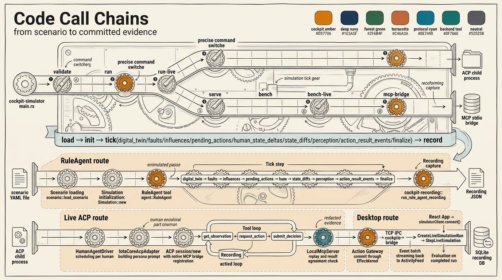

### 6.2 版本化 IPC 协议契约

`cockpit-simulator` 服务器提供基于 TCP Socket 的 JSON 协议 [crates/cockpit-simulator/src/ipc/proto.rs](file:///Users/han/codingx/abc/iota-cockpit/crates/cockpit-simulator/src/ipc/proto.rs)：

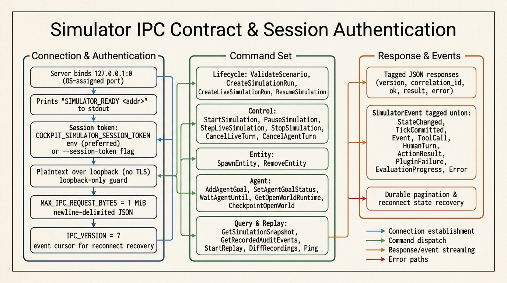

- **连接鉴权**：
  - 动态绑定 `127.0.0.1:0` 本地端口，在控制台标准输出打印 `SIMULATOR_READY <addr>`。
  - 强制校验 `COCKPIT_SIMULATOR_SESSION_TOKEN` 会话令牌。
  - 仅允许 Loopback 本地环回访问（除非显式开启 `--allow-remote`）。
- **协议版本与断线重连**：
  - 协议标记版本 `IPC_VERSION = 7`。
  - 所有推送事件携带递增 Cursor。客户端重连时可凭 Cursor 恢复丢失事件；若 Cursor 过期，可通过 `GetRecordedAuditEvents` 进行持久化分页恢复。

---

## 7. 不可变录制与独立评估平面

系统评测完全建立在仿真产生的不可变录制（Recording Trace）之上，彻底摒弃运行期嵌入式计分。

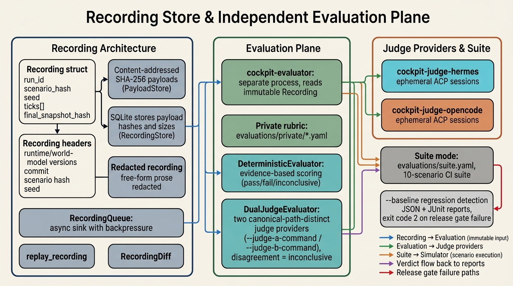

### 7.1 SHA-256 内容寻址录制

- 录制包 `Recording` 包含 `scenario_hash`、`seed`、`ticks[]` 增量与最终快照哈希 `final_snapshot_hash`。
- 采用 SQLite（`RecordingStore`）存储索引，数据块采用 SHA-256 内容寻址哈希文件库（`PayloadStore`）。
- 录制导出的公开 Trace 会自动对自由自然语言文本进行脱敏（`serialize_redacted_recording`）。

### 7.2 确定性评估与双 AI 判官 (Dual Judge)

独立评测工具 [cockpit-evaluator](file:///Users/han/codingx/abc/iota-cockpit/crates/cockpit-evaluator/src/main.rs) 采用双平面判定：

1. **DeterministicEvaluator**：基于录制事件序列匹配私有确定性规则，给出带证据引用的 Pass/Fail 结论。
2. **DualJudgeEvaluator**：配置两个规范路径完全隔离的大模型判官（如 `cockpit-judge-hermes` 与 `cockpit-judge-opencode`）：
   - 两个判官独立对不可变 Trace 进行评估；
   - **分歧弃权原则**：若两个判官结论不一致，或存在相同模型 identity 冒充，判定直接设为 `inconclusive` 并阻断 CI Release Gate（退出码 2）。

---

## 8. Desktop (Tauri 2) 客户端架构

`cockpit-desktop` 采用 Tauri 2 混合架构，提供高响应度的 1600x900 沉浸式测试控制台。

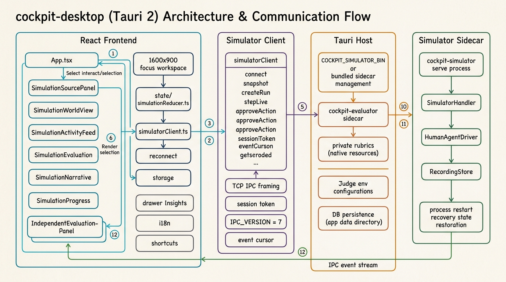

### 8.1 前后端模块职责

- **React 前端 (`apps/cockpit-desktop/src/`)**：
  - `SimulationSourcePanel.tsx`：场景选择、运行参数配置（Live/Rule 模式切换）。
  - `SimulationWorldView.tsx`：14 域座舱物理状态仪表盘、温度/气压/能见度可视化。
  - `SimulationActivityFeed.tsx`：实时事件流、Tool Call 追溯与乘员对话。
  - `IndependentEvaluationPanel.tsx`：评测报告展示、判官分歧对比与证据链跳转。
  - [simulationReducer.ts](file:///Users/han/codingx/abc/iota-cockpit/apps/cockpit-desktop/src/src/state/simulationReducer.ts)：状态机管理（`connectedIdle`, `running`, `completed`, `failed` 等）。
- **Tauri Native Host (`apps/cockpit-desktop/src-tauri/`)**：
  - 自动管理 `cockpit-simulator` 与 `cockpit-evaluator` Sidecar 进程生命周期。
  - 本地保护私有 Rubric 资源文件，确保 WebView 无法直接窥探评分标准。

---

## 9. 十个标杆场景实战指南

系统内置 14 域分类法下的 10 个测试场景。每个场景的运行上限为其评测截止时间后的 4 个验证 tick（20–34 tick），用于确认处置效果已稳定，而非统一空转至 80 tick：

| 场景 ID | 仿真目标 (Public Goal) | 评测关注点 (Private Rubric Objective) | 核心物理/风险特征 |
| :--- | :--- | :--- | :--- |
| `smoke-in-cockpit` | 从延迟感知中识别烟雾，协调乘员并消除直接危险 | 烟雾检测与动力关闭形成时序证据，安全/轨迹门通过 | 烟雾浓度上升、能见度下降、CO 风险 |
| `heatwave-thermal-comfort` | 在高温与注意力衰减中协调舒适、安全与能耗 | 热舒适恢复证据达到私有阈值并按时出现 | 外部高温辐射、舱温升至 45°C+ |
| `winter-defog-visibility` | 在寒雨与起雾中恢复视野并兼顾舒适 | 前风挡能见度恢复证据达到私有阈值 | 相对湿度 95%、风挡结雾 Beer-Lambert 能见度降 |
| `driver-fatigue-guardian` | 识别注意力下降并执行可理解的分级干预 | 驾驶员注意力恢复证据达到私有阈值 | PERCLOS 疲劳指标蓄积、分级声光干预 |
| `child-left-behind` | 在升温中确认儿童留存风险并启动保护 | 儿童保护后的安全舱温与报警证据达到阈值 | 滞留儿童心率/体温监测、热应激危险 |
| `medical-emergency` | 降低分心、协调救援并稳定医疗响应 | 患者生理指标稳定与靠边停靠证据达成 | 乘员急症、心率异常、紧急靠边与呼叫 |
| `voice-privacy-conflict` | 区分多人权限、保护隐私并降低驾驶分心 | 隐私隔离处置后驾驶员专注证据达成 | 多音区声纹识别、私密消息遮蔽 |
| `ev-range-anxiety` | 解释冬季续航风险并建立安全充电方案 | 方案接受与续航保护证据达成 | 低温电池衰减、动态里程规划 |
| `adas-takeover-construction` | 清晰沟通边界并完成施工区接管 | 接管后驾驶员接管控制权状态证据达成 | 施工障碍物、ADAS 边界退化提示 |
| `cybersecurity-anomalous-control` | 控制异常远程请求并保留安全本地功能 | 安全模式切入与异常阻断证据达成 | 异常 CAN 总线指令、本地控制权保护 |

### 9.1 桌面端运行步骤

1. 打开 `cockpit-desktop` 应用，在左侧 **SimulationSourcePanel** 中选择目标场景（如 `smoke-in-cockpit`）。
2. 查看场景卡片的公开契约：确认乘员 Persona、授权工具以及物理初始状态。
3. 点击 **“运行并评测” (Run & Evaluate)**：
   - 界面同步展示 WorldView 物理仪表盘演化与 ActivityFeed 事件流。
   - 仿真推进至该场景的验证窗口结束或提前 `completed` 后，Tauri Sidecar 自动调用 `cockpit-evaluator`。
4. 在 **IndependentEvaluationPanel** 检视评测报告：查看确定性 Rule 匹配项、双判官意见对比及证据 Tick 引用。

### 9.2 CLI 自动化批处理运行

使用项目根目录下的自动化测试命令运行标准评估套件：

```bash
# 验证所有场景 YAML 格式合规性
cargo run -p cockpit-simulator -- validate scenarios/smoke-in-cockpit.yaml

# 运行确定性离线 benchmark 套件 (10 个场景)
cargo run -p cockpit-evaluator -- \
  --suite evaluations/suite.yaml \
  --simulator-command "target/debug/cockpit-simulator" \
  --minimum-pass-rate 1.0

# 运行 live ACP 后端 benchmark 测试
cargo run -p cockpit-simulator -- bench-live \
  --suite evaluations/suite.yaml \
  --backend hermes
```
