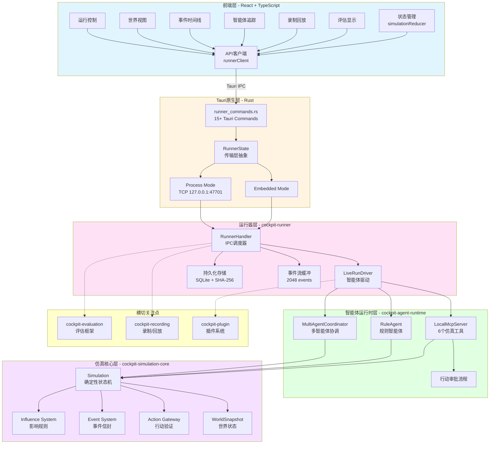
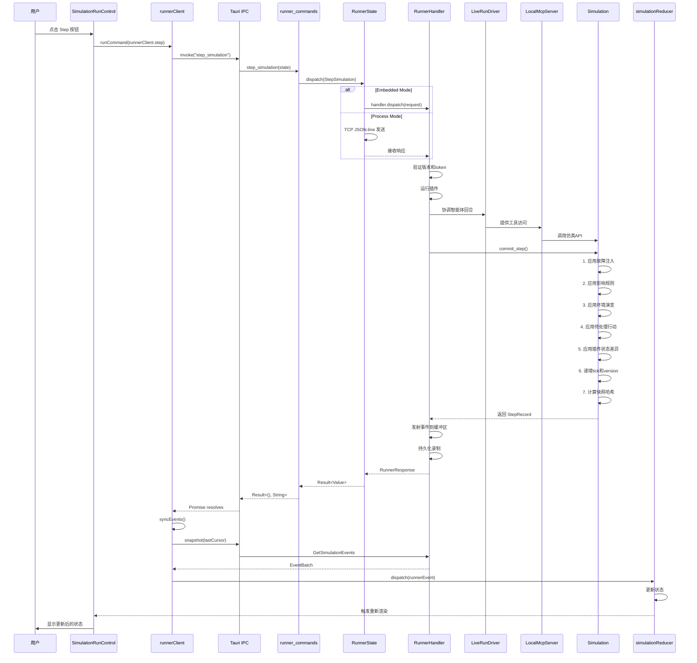
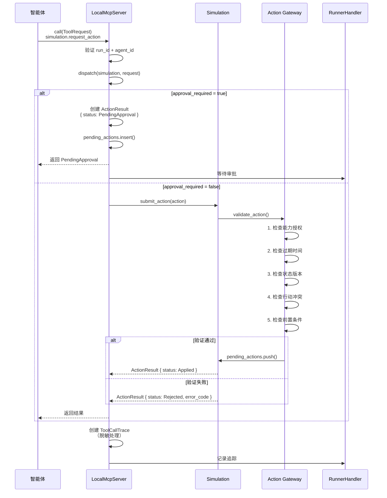
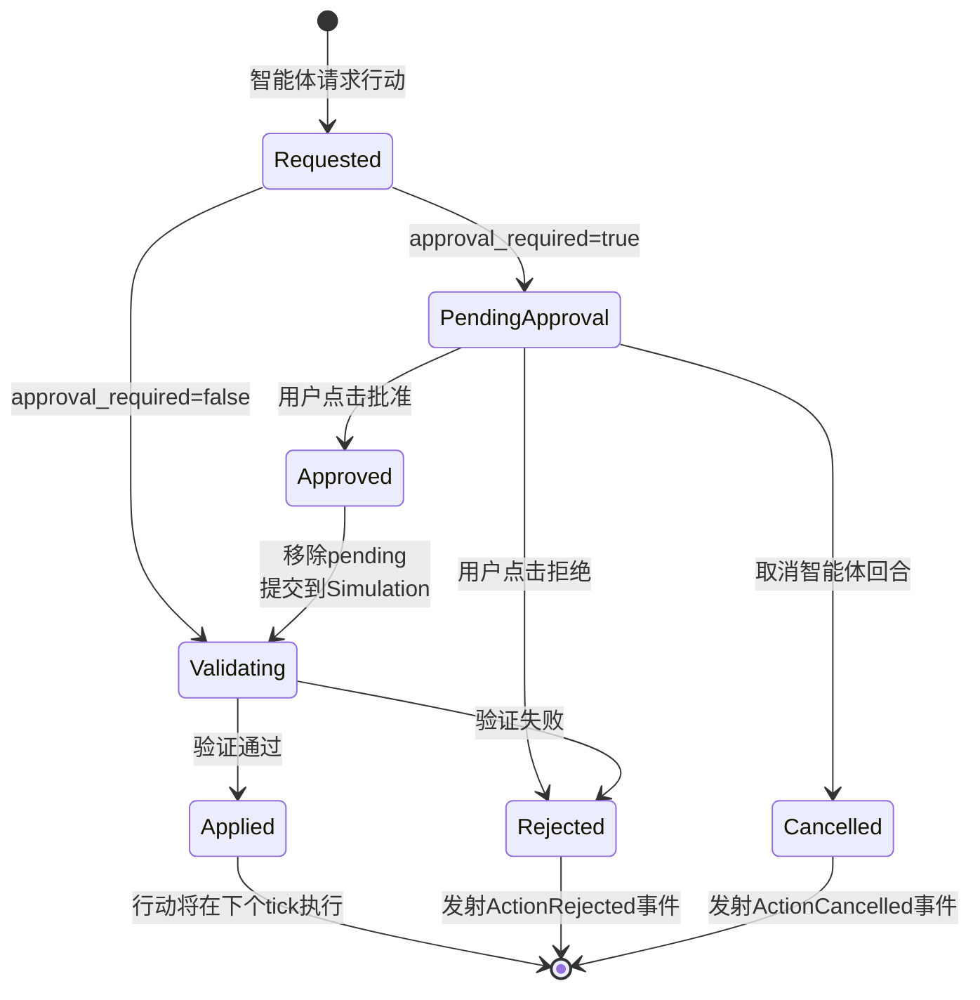
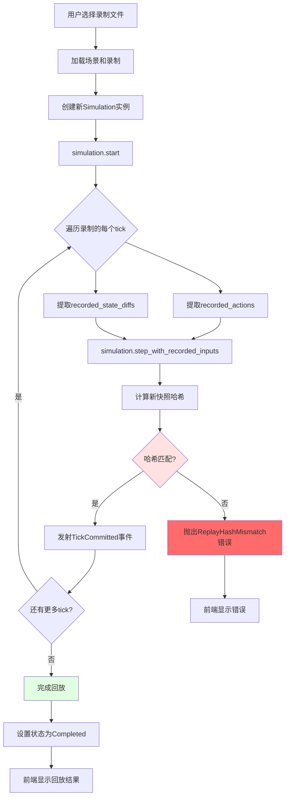
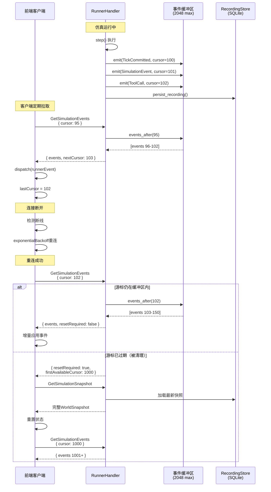
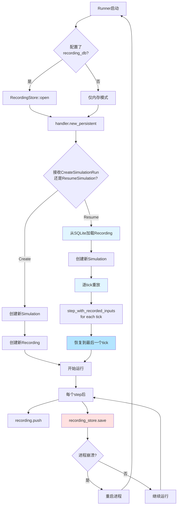
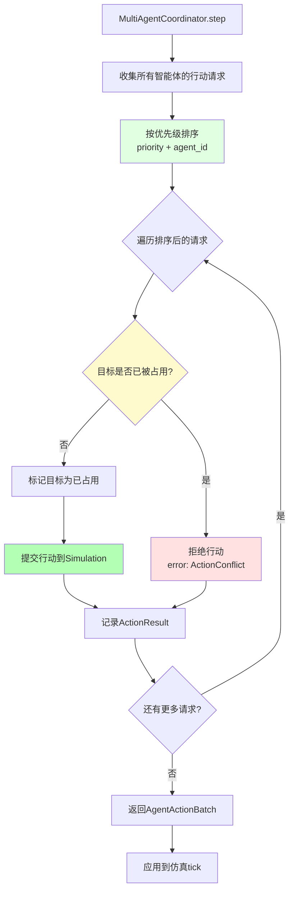
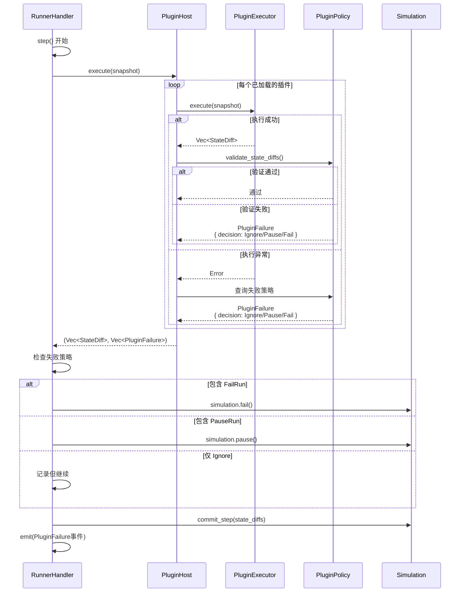
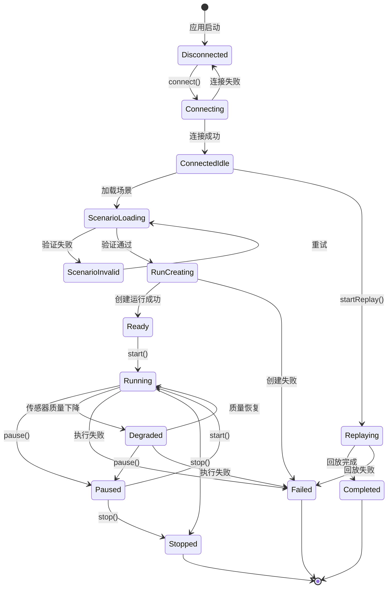

# Cockpit Simulator 可视化流程图

## 1. 系统架构层次图



## 2. 单步执行完整请求链路



## 3. 智能体工具调用流程



## 4. 行动审批流程



## 5. 录制回放与差异对比



## 6. 事件流与游标恢复机制



## 7. 持久化录制与进程重启恢复



## 8. 多智能体协调流程



## 9. 插件执行与失败处理



## 10. 完整生命周期状态机



---

## 使用说明

这些图表使用 Mermaid 语法编写，可以在支持 Mermaid 的 Markdown 渲染器中直接查看，例如：

- **GitHub**：直接在 `.md` 文件中显示
- **VS Code**：安装 Markdown Preview Mermaid Support 插件
- **在线工具**：https://mermaid.live/

如需导出为图片，可以使用 `mermaid-cli` 工具：

```bash
npm install -g @mermaid-js/mermaid-cli
mmdc -i visual-flow-diagrams-zh.md -o diagrams.pdf
```
